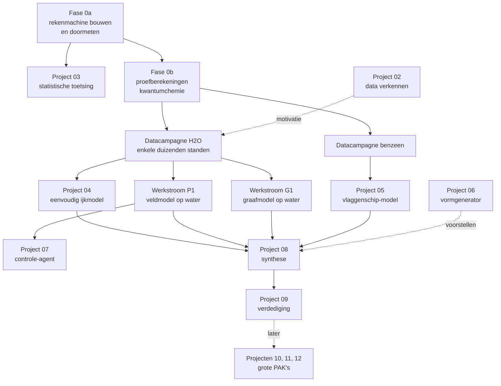

# Hoofdstuk 1 — Het probleem

> **In dit hoofdstuk leer je**
> – waarom sterrenkundigen willen weten welke moleculen er in de ruimte zweven;
> – hoe je met licht op afstand kunt vaststellen wélk molecuul je ziet;
> – waarom het uitrekenen van zo'n "vingerafdruk" op een computer zo duur is;
> – wat dit project daaraan wil doen, en wat het uitdrukkelijk *niet* belooft.

---

## §1.1 Moleculen die je nooit in handen krijgt

Tussen de sterren is het bijna leeg, maar niet helemaal. In interstellaire wolken
zweven stofdeeltjes en moleculen. Een belangrijke groep daarvan zijn de
**polycyclische aromatische koolwaterstoffen**, kortweg **PAK's** (Engels: PAH).

> **Definitie 1.1 — PAK**
> Een PAK is een molecuul dat uitsluitend bestaat uit koolstof (C) en waterstof (H),
> waarbij de koolstofatomen zesringen vormen die aan elkaar vastzitten als de
> tegels van een badkamervloer. Aan de rand zitten waterstofatomen.

Het eenvoudigste lid van de familie is **benzeen**, $\mathrm{C_6H_6}$: één ring.
Daarna komt **naftaleen**, $\mathrm{C_{10}H_8}$: twee ringen die één zijde delen
(dit is de stof in mottenballen). Daarna antraceen en fenantreen met drie ringen,
en zo verder tot moleculen met tientallen ringen zoals $\mathrm{C_{24}H_{12}}$
(coroneen).

Naar schatting zit een aanzienlijk deel van alle koolstof in het heelal in
zulke moleculen. Ze zijn dus niet exotisch — ze zijn een hoofdbestanddeel. Maar
niemand kan met een schepje naar een interstellaire wolk toe. Je kunt er alleen
naar *kijken*.

## §1.2 Licht als vingerafdruk

Als je een molecuul niet kunt vastpakken, kun je nog wel het licht opvangen dat
het uitzendt of doorlaat. Daar zit informatie in.

Een molecuul is niet stijf. De atomen erin trillen ten opzichte van elkaar, alsof
ze door veertjes verbonden zijn. Zo'n trilling heeft een vaste frequentie, en die
frequentie hangt af van:

- hoe zwaar de atomen zijn;
- hoe stevig de bindingen zijn;
- hoe het molecuul is opgebouwd.

Elk molecuul heeft daarom een **eigen verzameling trillingsfrequenties**. Die
frequenties liggen voor de meeste moleculen in het **infrarode** deel van het
spectrum: licht met een golflengte tussen ruwweg 2,5 en 25 micrometer, net buiten
het zichtbare rood.

> **Definitie 1.2 — Infraroodspectrum**
> Een grafiek die voor elke frequentie van infrarood licht aangeeft hoe sterk een
> stof dat licht absorbeert of uitzendt. De pieken in die grafiek heten **banden**.

Zo'n spectrum werkt als een vingerafdruk. Zie je in een sterrenkundige meting een
piek op precies de plaats waar naftaleen een piek hoort te hebben, dan is dat een
aanwijzing dat er naftaleen zit.

Sinds 2022 levert de **James Webb-ruimtetelescoop (JWST)** infraroodspectra van
ongekende kwaliteit. Het probleem is verschoven: we hebben nu prachtige metingen,
maar we weten van te weinig moleculen precies genoeg waar hun pieken horen te
liggen.

## §1.3 Waarom de vingerafdrukken ontbreken

Er zijn twee manieren om aan een vingerafdruk te komen.

**Manier 1: meten in het laboratorium.** Dat kan, maar je moet de stof dan wel
hebben. Voor veel grotere PAK's is dat lastig, en de meting gebeurt meestal in
een bevroren edelgas ("matrix-isolatie", ongeveer 10 K). De pieken verschuiven
daardoor 2 tot 15 cm⁻¹ ten opzichte van een vrij zwevend molecuul. Dat is precies
de nauwkeurigheid die je nodig hebt, dus die verschuiving is een echt probleem.

**Manier 2: uitrekenen.** De natuurwetten die de trillingen bepalen zijn bekend:
de kwantummechanica. In principe kun je alles uitrekenen. In de praktijk kost dat
zoveel rekentijd dat het voor grote moleculen onbetaalbaar wordt. Waarom, zie je
in de volgende paragraaf.

## §1.4 De rekenkosten lopen uit de hand

De gouden standaard in de kwantumchemie heet **CCSD(T)**. Wat dat precies is,
lees je in hoofdstuk 3; hier is alleen het kostenplaatje van belang.

> **Eigenschap 1.1 — Schaalgedrag van CCSD(T)**
> De rekentijd van een CCSD(T)-berekening groeit ongeveer met de **zevende macht**
> van de omvang van het molecuul:
> $$T \sim N^{7}$$
> waarin $N$ het aantal zogenoemde basisfuncties is — grofweg een maat voor het
> aantal elektronen en de fijnheid waarmee je hun wolk beschrijft.

Een zevende macht is meedogenloos. Een molecuul dat twee keer zo groot is, kost
niet twee maar $2^7 = 128$ keer zoveel tijd.

> **Voorbeeld 1.1**
> In dit project wordt gerekend met de basisset `cc-pVTZ`. Daarin heeft een
> koolstofatoom 30 basisfuncties, een waterstofatoom 14 en een zuurstofatoom 30.
> Bereken hoeveel duurder een CCSD(T)-berekening aan benzeen is dan aan water.
>
> *Uitwerking.*
> Voor water $\mathrm{H_2O}$: $N = 30 + 2 \times 14 = 58$.
> Voor benzeen $\mathrm{C_6H_6}$: $N = 6 \times 30 + 6 \times 14 = 264$.
>
> De verhouding is $\dfrac{264}{58} \approx 4{,}55$, dus
> $$\frac{T_{\text{benzeen}}}{T_{\text{water}}} \approx 4{,}55^{7} \approx 4 \times 10^{4}.$$
>
> Benzeen kost dus grofweg **veertigduizend keer** zoveel rekentijd als water.
> Duurt water één minuut, dan duurt benzeen bijna een maand.

> **Voorbeeld 1.2**
> Doe hetzelfde voor coroneen $\mathrm{C_{24}H_{12}}$ ten opzichte van benzeen.
>
> *Uitwerking.*
> $N = 24 \times 30 + 12 \times 14 = 888$, dus de verhouding is
> $888/264 \approx 3{,}36$ en
> $$3{,}36^{7} \approx 5 \times 10^{3}.$$
>
> Coroneen kost dus ongeveer **vijfduizend keer** zoveel als benzeen, en daarmee
> ongeveer $2 \times 10^8$ keer zoveel als water. Dat is geen kwestie van
> geduld meer; dat is technisch onmogelijk.

Dit ene sommetje is de reden dat dit hele project bestaat. Het legt namelijk een
**muur** bloot: de beste methode die we hebben, werkt precies níet voor de
moleculen die de sterrenkundigen willen hebben.

Let op de tussenstap in Voorbeeld 1.1: benzeen zit nog nét binnen bereik, maar
alleen als je er veel geduld en veel rekenkracht in stopt. In dit project is
benzeen dan ook de grootste molecule die daadwerkelijk op het hoogste niveau
wordt doorgerekend, en het is de zwaarste stap van het hele plan.

## §1.5 Het idee: laat een computer het landschap leren

Het idee achter dit project is een omweg. In plaats van elke keer opnieuw de
volledige kwantummechanica uit te rekenen, doe je het volgende:

1. Reken de dure methode **een paar duizend keer** uit, voor een klein molecuul in
   allerlei verwrongen standen.
2. Laat een **neuraal netwerk** uit die voorbeelden leren welke energie bij welke
   stand hoort.
3. Gebruik daarna alleen nog dat netwerk. Dat is miljoenen keren sneller.

Zo'n geleerd model van "stand van de atomen $\to$ energie" heet een **potentiële
energie-oppervlak** of PES (hoofdstuk 3). Uit een PES volgen de krachten, uit de
krachten volgt de beweging, en uit de beweging volgt uiteindelijk het spectrum.

Dit idee is niet nieuw. Er bestaan al werkende systemen van dit type. Het
onderscheidende van *dit* project zit in twee keuzes:

- **De leerstof is van hogere kwaliteit dan gebruikelijk.** De meeste bestaande
  modellen zijn getraind op data van het goedkopere niveau DFT. Hier wordt
  uitsluitend CCSD(T)-data gebruikt (hoofdstuk 3).
- **De vorm waarin het molecuul aan het netwerk wordt aangeboden is anders.**
  Gebruikelijk is een *graaf*: bolletjes (atomen) met streepjes (bindingen) ertussen.
  Hier wordt het molecuul aangeboden als een **continue elektronenwolk op een
  driedimensionaal rooster** (hoofdstuk 5).

Die tweede keuze is de eigenlijke onderzoeksvraag.

> **De centrale onderzoeksvraag**
> Als je twee modellen precies dezelfde leerstof geeft, generaliseert een model
> dat met een *rooster van elektronendichtheid* werkt dan beter naar trillingen
> die het nooit gezien heeft dan een model dat met een *graaf van atomen* werkt?

Merk op hoe bescheiden en hoe scherp die vraag is. Er wordt niet beweerd dat het
gaat werken. Er wordt een eerlijke vergelijking opgezet, en het antwoord mag ook
"nee" of "we konden het niet vaststellen" zijn.

## §1.6 Wat wél en wat niet wordt beloofd

Deze repository is opvallend streng over wat er beloofd mag worden. Dat komt door
een reeks kritische beoordelingen (te vinden in de bestanden
`Professor_Review_*.md`), waarin steeds werd aangetoond dat eerdere versies van
het plan te veel beloofden.

De uitkomst van die discussie staat in
[`Overarching_Goal.md`](../GoalGathering/Overarching_Goal.md) §3, en die maakt een
onderscheid dat je goed moet vasthouden:

| | Wat wordt beloofd | Wat níét wordt beloofd |
|---|---|---|
| **Leerstof (labels)** | Energieën op CCSD(T)/cc-pVTZ-niveau, gecontroleerd tegen een nog nauwkeuriger referentie | — |
| **Spectra** | Ligging van **banden** en hun onderlinge sterkte, met een genoemde marge van 10 tot 15 cm⁻¹ | Individuele spectraallijnen; nauwkeurigheid onder 1 cm⁻¹ |
| **Moleculen** | $\mathrm{H_2O}$, $\mathrm{D_2O}$, $\mathrm{CO_2}$, $\mathrm{C_6H_6}$ | Grote PAK's zoals $\mathrm{C_{48}}$ |
| **Toepassing** | Een betrouwbaarheidsgecontroleerd systeem voor kleine moleculen | Het daadwerkelijk identificeren van PAK's in JWST-data |

De reden voor die strengheid is een rekensom die je zelf kunt maken:

> **Voorbeeld 1.3**
> "Chemische nauwkeurigheid" betekent in de kwantumchemie: een energiefout kleiner
> dan 1 kcal/mol. Reken uit wat die fout betekent in golfgetallen (cm⁻¹).
>
> *Uitwerking.*
> $1\ \text{kcal/mol} \approx 350\ \text{cm}^{-1}$.
>
> Een dataset die "chemisch nauwkeurig" is, mag dus een fout van 350 cm⁻¹ hebben.
> Maar een spectraallijn moet op 0,1 cm⁻¹ kloppen. Dat verschilt een factor 3500.
> Beide beweringen "chemisch nauwkeurig" noemen is daarom misleidend — het zijn
> twee volstrekt verschillende eisen.

Wat de grote PAK's betreft: die zijn niet vergeten, maar uitgesteld. Ze vormen de
projecten 10, 11 en 12, die ná de master komen (hoofdstuk 17 t/m 19).

## §1.7 De keten in vogelvlucht

Voordat je de projecten één voor één doorloopt, is het handig het geheel te zien.
Lees dit schema als een lopende band: elk blok krijgt data binnen en levert data af.

De gestippelde pijlen zijn zwakke verbindingen: die projecten leveren motivatie of
gereedschap, geen data die verderop rechtstreeks wordt gebruikt.

## In het kort

- In interstellaire wolken zitten PAK's; JWST meet hun infraroodspectra.
- Om zo'n spectrum te herkennen moet je weten waar de banden van elk molecuul horen te liggen.
- De nauwkeurigste rekenmethode, CCSD(T), schaalt als $N^7$ en is daarmee onbruikbaar voor grote moleculen.
- Het plan: reken een klein molecuul duizenden keren door, laat een neuraal netwerk daaruit het energielandschap leren, en gebruik dat model daarna.
- De onderzoeksvraag is niet "kunnen we PAK's herkennen", maar: **generaliseert een roostervoorstelling beter dan een graafvoorstelling, bij gelijke leerstof?**
- Alle grote beloften over PAK's zijn expliciet uitgesteld naar de projecten 10 t/m 12.
