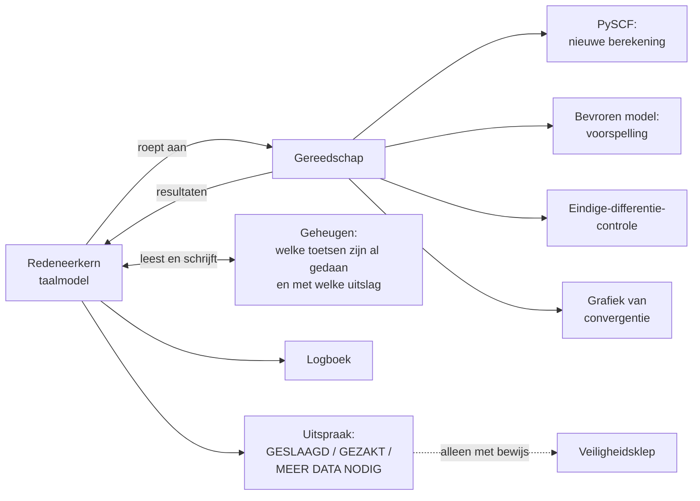

# Hoofdstuk 14 — Project 07: de automatische laboratoriumassistent

> **In dit hoofdstuk leer je**
> – wat een AI-agent is en waarin die verschilt van een gewone chatbot;
> – hoe uit een bevroren model daadwerkelijk een spectrum ontstaat (fase 2);
> – hoe je een model op de proef stelt met zwaar water en koolstofdioxide (fase 3);
> – wat *fail-closed* betekent en waarom dat hier de belangrijkste eigenschap is.

**Categorie in het plan:** (B)/(C) brug- en controleproject.
**Positie in de keten:** na werkstroom P1; gebruikt diens bevroren gewichten.

---

## §14.1 Wat is de vraag?

De schoolopdracht: bouw een agentisch systeem met redeneerlogica, een beperkt
geheugen, minstens één aanroep van extern gereedschap, en logboeken en
veiligheidsmaatregelen. Lever ook een architectuurdiagram.

De onderzoeksvraag eronder:

> Het plan bevat tientallen numerieke controles die "voortdurend" moeten worden
> uitgevoerd, niet alleen aan het begin. Dat is precies het soort werk waarbij een
> mens onder tijdsdruk een keer denkt: *die controle sla ik even over.*
> **Kun je dat automatiseren, inclusief het recht om "nee" te zeggen?**

## §14.2 Wat is een agent?

> **Definitie 14.1 — AI-agent**
> Een systeem rond een taalmodel dat niet alleen tekst produceert maar ook:
> - **gereedschap gebruikt** — programma's aanroept en de uitkomst terugleest;
> - **geheugen bijhoudt** — onthoudt wat er eerder is gedaan;
> - **beslist** — op grond van uitkomsten kiest wat de volgende stap is;
> - **logt** — vastlegt wat het heeft gedaan en waarom.

Het verschil met een gewone chatbot is de lus. Een chatbot krijgt een vraag en
geeft een antwoord. Een agent doorloopt herhaaldelijk: *waarnemen → nadenken →
handelen → waarnemen*.

## §14.3 Invoer

Dit project heeft **geen eigen dataset**. Het werkt op de uitkomsten van alles
wat ervoor kwam:

| Bron | Wat de agent ermee doet |
|---|---|
| De sweep-CSV van fase 0a (hoofdstuk 9) | Controleert de machinefouteisen |
| Het toetsrapport van P1 (hoofdstuk 11) | Controleert de krachten-, frequentie- en dipooleisen |
| De bevroren gewichten van P1 | Draait er simulaties mee |
| De drempelwaarden uit [Distilled Plan §7](../GoalGathering/Distilled_Project_Plan_and_Quality_Checks.md) | Toetst gemeten waarden hieraan |

En daarnaast het gereedschap dat de agent zelf mag aanroepen: PySCF voor een
nieuwe kwantumberekening, het bevroren model voor een voorspelling, een
eindige-differentiecontrole, en een tekenroutine voor convergentiegrafieken.

## §14.4 Fase 2: hier ontstaat het eerste spectrum

Voordat de agent iets kan beoordelen, moet er iets te beoordelen zijn. In dit
project worden de fasen 2 en 3 uitgevoerd, en dat zijn de fasen waarin voor het
eerst een infraroodspectrum verschijnt.

> **Stappenplan 14.1 — Van bevroren gewichten naar spectrum**
>
> **Invoer:** de bevroren gewichten van P1 en één beginstand van een watermolecuul.
>
> **Stap 1 — Opwarmen.** Laat het molecuul in een NVT-simulatie op 300 K komen.
> De atomen krijgen zo een realistische energieverdeling.
>
> **Stap 2 — Meten.** Schakel over op NVE (geen warmtebad meer) en simuleer
> 50 picoseconde met stappen van 0,5 femtoseconde: 100 000 stappen. Herhaal dit met
> 5 tot 10 onafhankelijke beginsituaties.
>
> **Stap 3 — Dipoolmoment volgen.** Bereken bij elke tijdstap
> $\boldsymbol\mu(t) = -\int\mathbf r\,\Delta\rho_\theta\,\mathrm dV$ (§5.3).
>
> **Stap 4 — Autocorreleren.** Bereken $C(t) = \langle\boldsymbol\mu(0)\cdot\boldsymbol\mu(t)\rangle$
> volgens Definitie 4.7.
>
> **Stap 5 — Fourier-transformeren**, met de kwantumcorrectiefactor uit
> Eigenschap 4.3.
>
> **Uitvoer:** een spectrum — twee kolommen, golfgetal en intensiteit — met een
> resolutie van 0,67 cm⁻¹ (Voorbeeld 4.2).

**De toets van fase 2.** De drie banden van water moeten binnen 10 tot 15 cm⁻¹
van de gemeten waarden liggen:

| Band | Verwacht |
|---|---|
| $\nu_1$ symmetrisch strekken | 3657 cm⁻¹ |
| $\nu_2$ buigen | 1595 cm⁻¹ |
| $\nu_3$ asymmetrisch strekken | 3756 cm⁻¹ |

En nu het punt dat je moet vasthouden: **die getallen zijn nooit aan het model
verteld.** Het model is getraind op energieën, krachten, één kromming, een
dichtheid en dipoolmomenten van stilstaande moleculen. Het heeft nooit een
spectrum gezien. De banden komen tevoorschijn omdat het molecuul in het geleerde
landschap vanzelf zo beweegt. Dat is wat het plan **emergent** noemt.

## §14.5 Fase 3: de hardheidstests

Fase 2 laat zien dat het model water aankan. Fase 3 vraagt of het ook *natuurkunde*
heeft geleerd, of alleen water uit het hoofd.

### Test 1 — Zwaar water

Verander alleen de massa van waterstof van 1 u naar 2 u. Geen hertraining, geen
nieuwe data, geen nieuwe berekening: het is dezelfde elektronenwolk (§2.7).

Verwacht: alle O–H-banden verschuiven met een factor tussen 1,35 en 1,39.

Deze test is uitdrukkelijk **niet** het hoofdbewijs. Vrijwel elk redelijk model
haalt hem, want de factor volgt bijna volledig uit $f \propto 1/\sqrt\mu$. De
waarde zit in de omkering: haalt het model hem níét, dan is er iets fundamenteel
mis.

### Test 2 — Koolstofdioxide

Dit is de scherpere test. $\mathrm{CO_2}$ is lineair en symmetrisch — een heel
andere vorm dan water. Toch mag het model niet opnieuw getraind worden.

Waar gelet wordt:

| Toets | Eis | Waarom |
|---|---|---|
| Verboden trilling | $I(\nu_1)/I(\nu_3) < 10^{-2}$ | De symmetrische strek moet vrijwel onzichtbaar zijn (Voorbeeld 2.4) |
| Consistentie | de gemeten verhouding moet ongeveer $\delta^2$ zijn | $\delta$ is de onafhankelijk gemeten fout in $\mathrm d\boldsymbol\mu/\mathrm dQ$ uit fase 1 |
| Actieve trillingen | $\nu_2$ en $\nu_3$ moeten wél verschijnen | Anders is het model gewoon stil |

De tweede rij is een fraai staaltje wetenschappelijke discipline. Het zou
makkelijk zijn geweest om te eisen dat de verboden piek "ongeveer nul" is. Maar
nul kan hij niet worden, want het voxelrooster breekt de symmetrie van het
molecuul een beetje (§9.5). Het plan eist daarom dat de restpiek **precies zo
groot is als je op grond van een onafhankelijke meting zou verwachten**. Is hij
veel groter, dan heeft het model een werkelijk scheve elektronenwolk geleerd — en
dan is het een natuurkundige fout, geen rekenfout.

## §14.6 De agent zelf

De agent bestaat uit vier onderdelen.

**Redeneerkern.** Krijgt een fase met de bijbehorende drempelwaarden, en beslist:
GESLAAGD, GEZAKT, of MEER DATA NODIG. In dat laatste geval beslist hij ook welke
extra controle er moet komen.

**Gereedschap.** Vier soorten aanroepen, zoals in het diagram. Dit voldoet aan de
eis van minstens één externe functieaanroep — met ruime marge.

**Geheugen.** Een opgeslagen logboek van welke controles al zijn gedaan en met
welke uitslag. Dat is nodig omdat de controles verspreid over weken plaatsvinden.
De schooleis "beperkt geheugen of toestand" wordt hier ingevuld met iets dat een
echte functie heeft.

**Logboek.** Elke beslissing wordt vastgelegd, inclusief de aangeroepen
gereedschappen en de teruggekregen getallen.

## §14.7 De veiligheidsklep: fail-closed

Dit is het hart van het project, en het is tegelijk de ethiekparagraaf die de
opdracht verlangt.

> **Het risico, concreet**
> Een autonome agent die "GESLAAGD" uitspreekt zonder de vereiste controle
> werkelijk te hebben uitgevoerd. Dat klinkt als een klein probleem, maar het is
> het tegenovergestelde: alle verdere stappen — de simulaties, de spectra, de
> vergelijking, de conclusies — bouwen op die uitspraak. Eén onterechte
> goedkeuring vervuilt de hele keten, en juist omdat een agent er zelfverzekerd
> uitziet, valt het niet op.

De maatregel:

> **Regel**
> De agent mag "GESLAAGD" uitsluitend uitspreken samen met de **gemeten waarde
> naast de gecontroleerde drempel**. Zonder dat paar is de uitspraak ongeldig.

> **Definitie 14.2 — Fail-closed**
> Een systeem dat bij twijfel, ontbrekende data of storing de **veilige** kant
> kiest — hier: weigeren goed te keuren. Het tegenovergestelde, *fail-open*,
> keurt bij twijfel goed en is in de veiligheidskunde berucht.

Dat principe loopt door het hele plan heen, ook buiten dit project:

| Waar | Wat er gebeurt bij ontbrekend bewijs |
|---|---|
| Nauwkeurigheidsaudit (§3.6) | Niet uitgevoerd = niet geslaagd; de bewering wordt afgezwakt |
| Werkstroom G1 (§11.6) | Ontbreekt MACE, dan is de vergelijking onvolledig — geen vervanging |
| Dipooltoetsen (§11.2) | Niet gehaald, dan geen productiesimulatie en geen intensiteitsclaims |
| Project 12 (hoofdstuk 19) | Geen overtuigende match = "niet geïdentificeerd", geen "consistent met" |

## §14.8 Wat als P1 gezakt is?

Dit is het mooiste detail van het hele hoofdstuk.

Stel het veldmodel haalt zijn eisen niet. Dan zou je verwachten dat project 07
ook in de problemen komt — het draait immers op dat model.

Het plan zegt het omgekeerde. De taak van de agent is de controles uitvoeren en
een onderbouwd oordeel geven. Is dat oordeel GEZAKT, dan heeft de agent zijn werk
**perfect gedaan**. Een geblokkeerde toets is een geldige demonstratie; een
verzonnen goedkeuring is dat niet.

In de woorden van het plan: *"Module 07 must not assume 'Phase 1 exists and
passed.' It assumes 'P1 produced a gate report', which may be FAIL."*

Wat er dan wél gebeurt: de fasen 2 en 3 worden als **geblokkeerd** gemarkeerd —
niet stilzwijgend overgeslagen, en niet vervangen door een ander model dat
toevallig wel werkt.

## §14.9 Uitvoer

| Bestand | Inhoud |
|---|---|
| `agentic_system.ipynb` of `.py` | De agent zelf |
| `Agentic_AI_Systems_Analysis_Report.pdf` | Verslag met een concreet beslissingsvoorbeeld en de ethiekparagraaf |
| Architectuurdiagram | Zoals in §14.6 |
| Agentlogboek | JSON met de afgelegde beslissingen |
| `requirements.txt` | Softwareversies |

Voor het onderzoek: de spectra van $\mathrm{H_2O}$, $\mathrm{D_2O}$ en
$\mathrm{CO_2}$, plus een geautomatiseerde controlelaag die in project 08 als
betrouwbaarheidslaag wordt hergebruikt.

## §14.10 Waarom deze stap?

**Rubriek.** Echt redeneren, echt gereedschap, echt geheugen, en een ethiekrisico
dat specifiek is voor dít systeem in plaats van een algemeen verhaal over AI.

**Wetenschap.** [Distilled Plan §8](../GoalGathering/Distilled_Project_Plan_and_Quality_Checks.md)
somt tien controleprotocollen op die "overal en altijd" moeten gelden. In de
verdeling over de projecten bleek dat niemand daar eigenaar van was. Dit project
maakt er een systeem van.

**Menselijk.** Het plan is eerlijk over de reden: de gevaarlijkste fout in een
onderzoek van deze omvang is niet een verkeerde berekening maar een **overgeslagen**
controle. Een agent die weigert goed te keuren zonder bewijs, beschermt de
onderzoeker tegen zichzelf.

## In het kort

- **Invoer:** geen nieuwe dataset, maar de logbestanden en bevroren gewichten van alle eerdere fasen.
- **Bewerking:** de agent voert de fasen 2 en 3 uit — simuleren, autocorreleren, Fourier-transformeren — en toetst de uitkomsten aan de vooraf vastgelegde drempels.
- **Uitvoer:** de eerste spectra van water, zwaar water en koolstofdioxide, plus een geautomatiseerd oordeel per eis.
- De banden zijn **emergent**: nooit aan het model verteld, alleen het gevolg van het geleerde landschap.
- De hardheidstests zijn zwaar water (verschuiving 1,35–1,39) en $\mathrm{CO_2}$ (verboden trilling onder 1%).
- De kern is *fail-closed*: geen goedkeuring zonder gemeten waarde naast de drempel — en als het model gezakt is, is een weigering de juiste demonstratie.
