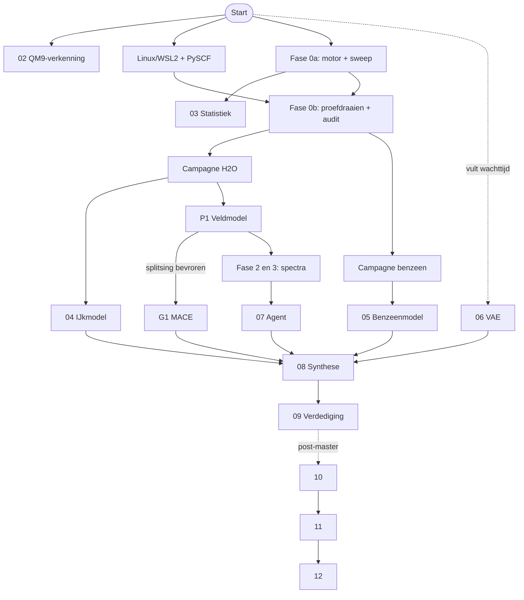

# Hoofdstuk 20 — Totaaloverzicht en woordenlijst

---

## §20.1 De hele keten in één tabel

Lees elke rij als: *deze stap krijgt dit binnen, doet dit, en levert dit af.*

| Stap | Invoer (structuur en herkomst) | Bewerking | Uitvoer (structuur en betekenis) |
|---|---|---|---|
| **01** APA | Wetenschappelijke artikelen en documentatie | Schrijf- en verwijsregels leren | Vaste afspraken voor alle verslagen: bron of meting bij elke bewering, DOI bij elke dataset |
| **02** Verkenning | Tabel met 5000–10 000 QM9-moleculen; eigenschappen op DFT-niveau; openbaar | Circa 3054 gemarkeerde rijen verwijderen; beschrijvende statistiek; ≥3 grafieken | Notitieboek + verslag met de **onderbouwde conclusie dat deze data niet volstaat** |
| **Fase 0a** Motor | Analytische testdichtheden; geen kwantumchemie | Rekenmachine bouwen en doormeten onder gelote omstandigheden | Werkende motor + CSV van 800 rijen × 15 kolommen |
| **03** Statistiek | Die sweep-CSV | Twee-weg-ANOVA op de eierdooskracht | Verslag: hangt de machinefout af van $\sigma/\Delta x$, en van het molecuul? |
| **Fase 0b** Proefdraaien | 1 + 10 geometrieën van water en benzeen; vereist Linux/WSL2 | Rekentijd en geheugen meten; de nauwkeurigheidsaudit uitvoeren | Kostentabel, gekozen rekenroute, **toegestane bewoording** over nauwkeurigheid |
| **Campagne H₂O** | ~2000 waterstanden | CCSD(T)/cc-pVTZ doorrekenen | Descriptor-CSV **en** volumetrische tensoren — één campagne, twee producten |
| **04** IJkmodel | Die CSV: `config_id`, 2 afstanden, 1 hoek, energie, 9 krachten | KRR/GPR of klein netwerk trainen | Getraind model + foutmaten: **het ondergrens-ijkpunt** |
| **P1** Veldmodel | $32^3$-tensoren van water, ≥2000 stuks | Drie modellen trainen: productie, Field-EF, Field-EFρ | Bevroren gewichten + toetsrapport tegen de fase-1-eisen |
| **G1** Graafmodel | Dezelfde `config_id`s, alleen $E$ en afgeleiden | MACE vanaf nul trainen | Bevroren gewichten + toetsrapport op **dezelfde splitsing** |
| **Campagne C₆H₆** | ~5000 benzeenstanden (streefgetal) | Tweede CCSD(T)-campagne | $64^3$-tensoren + manifest; extern gehost met DOI |
| **05** Vlaggenschip | Die tensoren | Twee identieke trainingen, alleen de FNO-laag verschilt | Benzeenmodel + antwoord: loont niet-plaatselijke menging? |
| **06** Generator | 1000–2000 geometrieën van 5–8 niet-benzeen-aromaten, goedkoop niveau | VAE trainen op geometrieën | Gegenereerde vormen + beoordeling + één gedocumenteerde mislukking |
| **Fase 2** Eerste spectrum | Bevroren P1-gewichten | 5–10 trajectorieën van 50 ps; dipoolautocorrelatie; Fourier | Spectrum van water; banden binnen 10–15 cm⁻¹ |
| **Fase 3** Hardheid | Dezelfde gewichten, alleen de massa's gewijzigd | Zwaar water; koolstofdioxide | Isotoopverschuiving 1,35–1,39; verboden trilling onder 1% |
| **07** Agent | Alle logbestanden en toetsrapporten | Controles uitvoeren en beoordelen | GESLAAGD/GEZAKT **met gemeten waarde naast de drempel**, plus de spectra van fase 2 en 3 |
| **08** Synthese | ≥3 van {04, 05, 06, 07} + de G1-rapportage | De vooraf vastgelegde tabellen invullen | Geïntegreerd systeem + reflectiepaper + het **antwoord op de onderzoeksvraag** |
| **09** Verdediging | Project 08 en alle toetsrapporten | Presentatie in zeven onderdelen + 15 minuten vragen | Verdedigd eindwerk; drie foutbronnen apart gerapporteerd |
| **10** Opschalen | De uitkomst van 08; een theorieladder | Verankering meten; van voorstelling wisselen indien nodig | Dataset van meerdere groottes + overdrachtsrapport benzeen → 4 ringen |
| **11** Echte spectra | Landschap uit 10 + dipooloppervlak | GVPT2, met VCI waar nodig | Anharmonische banden + intensiteiten + foutbudget A–D |
| **12** Identificatie | Banden uit 11 + één bevroren waarneming | Excitatiemodel + vooraf vastgelegde vergelijking | Tabel soort × band × maat × oordeel, plus negatieve controle |

## §20.2 De afhankelijkheidsketen

Drie sporen gaan bij de start tegelijk open: project 02, het inrichten van de
Linux-omgeving, en fase 0a. Project 06 hangt van niets af en vult wachttijd.
Project 03 hangt alleen van fase 0a af — dat is met opzet zo ontworpen, om het
tweede in te leveren project van het kritieke pad van de kwantumchemie te halen.

**Het tijdsbeslag.** In [Capstone_Mapping §8.3](../GoalGathering/Capstone_Mapping.md)
staat de rekensom: het kritieke pad, **zonder** de twee rekencampagnes en zonder
de audit, komt neer op ongeveer 840 werkuren. Bij tien uur per week zijn dat
ongeveer 84 kalenderweken. De campagnes komen daar nog bij. De eerdere schatting
van 26 tot 30 weken is daarom niet ingekort maar verworpen.

## §20.3 De zeven terugkerende principes

Wie de twintig hoofdstukken naast elkaar legt, ziet dezelfde denkwijze steeds
terugkomen. Deze zeven principes zijn de eigenlijke inhoud van dit plan.

**1. Meten in plaats van beweren.**
Elk getal dat ertoe doet, is nagerekend in een klein programma
([`probes/`](../probes/)) of wordt gemeten voordat het beloofd wordt. Een eerdere
versie beweerde 800 rijen bij een opzet die er 1300 opleverde.

**2. Eenheden die bij de eis passen.**
Een energiefout is een krachtfout in vermomming. Alles wat uiteindelijk in
meV/Å wordt getoetst, wordt ook in meV/Å gerapporteerd (§5.4).

**3. Machinefout is nooit ruis.**
Een gebrek van de rekenmachine is een bug met een plafond en mag de acceptatie-eis
nooit verruimen. Alleen onvermijdelijke onzekerheid in de data mag dat (§5.4).

**4. Alles wat de uitkomst kan sturen, ligt vooraf vast.**
De splitsing met controlegetal, het aantal startgetallen, de effectgrootte, de
analysemethode, de kandidatenlijst bij een waarneming. Vooraf is het een
beslissing, achteraf een uitvlucht (§11.5, §19.4).

**5. Fail-closed.**
Ontbrekend bewijs telt nooit als geslaagd. Dat geldt voor de nauwkeurigheidsaudit,
voor de agent, voor een ontbrekende MACE-run en voor een identificatie (§14.7).

**6. Eén veranderde variabele tegelijk.**
Field-EF tegen Field-EFρ verschilt alleen in $\lambda_\rho$; met-FNO tegen
zonder-FNO verschilt alleen in die laag; zwaar water verschilt alleen in de massa
(§11.3, §12.3, §2.7).

**7. Schrijf het ongemakkelijke zelf op.**
De dichtheid komt van CCSD en niet van CCSD(T). Dit is orbital-free DFT. De
plaatselijke functionaal is precies de vorm die volgens de stelling van Teller het
slechtst overdraagt. Elke gebruikte terugvaltrede wordt genoemd. Wie zijn eigen
zwakke plek noemt, houdt de regie over het gesprek erover (§3.8, §12.5, §16.5).

## §20.4 Formuleoverzicht

| Onderwerp | Formule |
|---|---|
| Trillingsfrequentie | $f = \dfrac{1}{2\pi}\sqrt{\dfrac{k}{\mu}}$, met $\mu = \dfrac{m_1m_2}{m_1+m_2}$ |
| Golfgetal | $\tilde\nu = 1/\lambda = f/c$ |
| Aantal normaaltrillingen | $3N-6$ (niet-lineair), $3N-5$ (lineair) |
| IR-selectieregel | actief als $\mathrm d\boldsymbol\mu/\mathrm dQ \neq \mathbf 0$ |
| Intensiteit | $I \propto |\mathrm d\boldsymbol\mu/\mathrm dQ|^2$ |
| Isotoopverschuiving | $f_1/f_2 = \sqrt{\mu_2/\mu_1}$ |
| Elektronenaantal | $\int\rho\,\mathrm dV = N_e$ |
| Kracht uit energie | $\mathbf F_A = -\partial E/\partial\mathbf R_A$ |
| Conservatief veld | $\oint\mathbf F\cdot\mathrm d\mathbf R = 0$ |
| Centrale differentie | $f'(x)\approx\dfrac{f(x+h)-f(x-h)}{2h}$ |
| Fourier-resolutie | $\Delta\tilde\nu = 1/(cT)$ |
| Nyquist | $f_{\max} = 1/(2\Delta t)$ |
| Spectrum | $I(\omega)\propto\omega\tanh\!\big(\tfrac{\beta\hbar\omega}{2}\big)\displaystyle\int\langle\boldsymbol\mu(0)\cdot\boldsymbol\mu(t)\rangle e^{-i\omega t}\mathrm dt$ |
| Referentiesplitsing | $\rho_{\text{tot}} = \rho_{\text{ref}} + \Delta\rho_\theta$, met $\int\Delta\rho_\theta\,\mathrm dV = 0$ |
| Dipoolmoment | $\boldsymbol\mu = -\displaystyle\int\mathbf r\,\Delta\rho_\theta\,\mathrm dV$ |
| Energiefunctionaal | $E_\theta = \sum_A E^{\text{atoom}}_{Z_A} + E_{\text{es}}[\rho_{\text{tot}},\mathbf R] + \displaystyle\int\varepsilon_\theta\,\mathrm dV$ |
| Eierdooskracht | $F_{\max} = \pi A/\Delta x$ |
| CBS-extrapolatie | $E_{\text{ref}} = E_{\mathrm{HF},Q} + \dfrac{64\,E_{\text{corr},Q} - 27\,E_{\text{corr},T}}{37}$ |
| RMSE | $\sqrt{\frac1n\sum(\hat y_i - y_i)^2}$ |
| Effectgrootte | $r = \mathrm{RMSE}^F_{\text{Field-EF}} / \mathrm{RMSE}^F_{\text{MACE-EF}}$ |
| CCSD(T)-schaalgedrag | $T \sim N^7$ |

**Omrekentabel**

$$1\ \mathrm{hartree} = 627{,}5\ \mathrm{kcal/mol} = 27{,}211\ \mathrm{eV} = 219\,474\ \mathrm{cm^{-1}}$$
$$1\ \mathrm{kcal/mol} = 350\ \mathrm{cm^{-1}} \qquad 1\ a_0 = 0{,}5292\ \text{Å} \qquad 1\ e\,a_0 = 2{,}542\ \mathrm{D}$$
$$1\ \mathrm{meV/\text{Å}} = 1{,}95\times10^{-5}\ \text{a.u.}$$

## §20.5 Woordenlijst

**Anharmoniciteit** — De afwijking van een echte binding van het volmaakte
veermodel; verantwoordelijk voor boventonen en voor een frequentieverschuiving van
enkele procenten. §2.8

**Augmentatie** — Extra trainingsvoorbeelden die uit bestaande worden gemaakt
zonder nieuwe berekening, hier door het molecuul te draaien of te verschuiven.
Tellen niet mee voor het rekenbudget. §6.3

**Autograd** — Automatisch differentiëren: de computer past de kettingregel toe op
elke elementaire bewerking en levert zo een exacte afgeleide. §4.5

**Basisset** — De verzameling standaardfuncties waaruit een elektronenwolk wordt
opgebouwd; `cc-pVTZ` is de keuze in dit project. §3.5

**Born–Oppenheimer** — De benadering dat kernen stilstaan terwijl de elektronen
worden uitgerekend, omdat kernen duizenden keren zwaarder zijn. §3.2

**CBS** — *Complete Basis Set*: de denkbeeldige limiet bij een oneindig fijne
basisset, benaderd door extrapolatie vanuit twee basissets. §3.6

**CCSD(T)** — De gouden standaard van de kwantumchemie; schaalt als $N^7$. §3.4

**Conservatief** — Eigenschap van een krachtenveld waarbij de arbeid over elke
gesloten weg nul is. Gegarandeerd als de kracht min de gradiënt van een energie is.
§4.3

**Configuratie** — Eén stand van een molecuul, met een uniek `config_id`; de
basiseenheid van alle data in dit project. §6.2

**Deformatiedichtheid ($\Delta\rho$)** — Het verschil tussen de echte
elektronenwolk van een molecuul en de som van losse atoomwolken. Glad, klein, en
het enige wat op het rooster komt. §5.3

**DFT** — Dichtheidsfunctionaaltheorie; goedkoop, wijdverbreid, en in dit project
verboden als bron van leerstof — hoewel de vorm $E = \mathcal E[\rho]$ juist het
onderwerp is. §3.7

**DOI** — Permanent identificatienummer van een publicatie of dataset. §7.3

**Eierdooseffect** — De kunstmatige, periodieke energieschommeling als een molecuul
over een rooster schuift. §5.4

**Emergent** — Een resultaat dat niet is aangeleerd maar vanzelf uit het model
volgt; hier de trillingsbanden. §14.4

**Equivariantie** — Eigenschap dat de uitvoer precies meedraait met de invoer. MACE
heeft die per constructie; een voxelrooster niet. §11.4

**Fail-closed** — Bij twijfel of ontbrekend bewijs de veilige kant kiezen, dus
weigeren goed te keuren. §14.7

**FNO** — *Fourier Neural Operator*: een laag die het hele rooster in één stap
mengt via het frequentiedomein. §5.8

**Fermi-resonantie** — Twee trillingstoestanden met bijna gelijke energie die
elkaar sterk beïnvloeden en een dubbelpiek vormen. §18.4

**GVPT2** — Storingsrekening voor trillingen die resonanties apart behandelt. §18.4

**Hessiaan** — De matrix van alle tweede afgeleiden van de energie; levert via haar
eigenwaarden alle harmonische trillingsfrequenties. §4.2

**Hockney–Eastwood** — Methode om de vergelijking van Poisson op te lossen voor een
**geïsoleerd** systeem, door de doos met nullen op te vullen en de Coulomb-kern af
te kappen. §5.6

**Latente ruimte** — De kleine, samengeperste voorstelling binnen in een
autoencoder. §13.4

**Leave-one-mode-out** — Splitsing waarbij een hele familie trillingen uit de
trainingsdata wordt gehouden; veel strenger dan een willekeurige splitsing. §4.9

**MACE** — Een modern equivariant grafenneuraal netwerk; hier de tegenstander in de
hoofdvergelijking. §11.4

**Manifest** — De tabel met herkomstgegevens bij een dataset. Zonder manifest is
het geen dataset. §6.4

**Matrixverschuiving** — De verschuiving van 2 tot 15 cm⁻¹ die optreedt als een
molecuul in bevroren edelgas wordt gemeten in plaats van vrij zwevend. §18.6

**NCA** — *Neural Cellular Automaton*: een geleerde regel die per voxel wordt
toegepast op een blokje van $3\times3\times3$. §5.8

**Normaaltrilling** — Een bewegingspatroon waarin alle atomen in fase en met
dezelfde frequentie bewegen. §2.4

**Orbital-free DFT** — De onderzoeksrichting waar dit project toe behoort: energie
uit de dichtheid, zonder de Kohn–Sham-vergelijkingen. §12.5

**PAK / PAH** — Polycyclische aromatische koolwaterstof: gekoppelde koolstofringen
met waterstof aan de rand. §1.1

**PES** — Potentiële-energie-oppervlak: de functie van kernposities naar energie.
§3.3

**Pre-registratie** — Het vooraf en onveranderlijk vastleggen van opzet en analyse
van een experiment. §11.5

**Promolecuul** — De hypothetische stapel losse, bolvormige atomen op de posities
van het echte molecuul; dient hier als bevroren referentie. §5.3

**Route B** — De keuze om alleen energie te voorspellen en krachten daaruit af te
leiden; garandeert conservatieve krachten. §4.3

**RMSE** — Wortel uit de gemiddelde kwadratische fout. §4.8

**Size-extensief** — Bruikbaar blijvend naarmate het systeem groeit. §17.1

**Sweep** — Een systematische doormeting over een raster van instellingen. §9.3

**Teller, stelling van** — In een zuiver plaatselijke dichtheidsfunctionaal binden
moleculen helemaal niet. Het fundamentele risico van dit ontwerp. §12.6

**VAE** — *Variational autoencoder*: een generatief model met een gladde latente
ruimte. §13.4

**Voxel** — Een blokje van het driedimensionale rooster; het ruimtelijke broertje
van de pixel. §5.1

## §20.6 Tot slot

De meest opvallende eigenschap van deze repository is niet de architectuur en niet
de kwantumchemie. Het is dat het document zichzelf voortdurend **kleiner** maakt.

De oorspronkelijke ambitie was: chemisch nauwkeurige infraroodspectra van
willekeurig grote PAK's, met een door AI ontdekte universele regel. Wat er na
meerdere kritische beoordelingsrondes van over is:

> Onder gelijke supervisie op CCSD(T)-data, generaliseert een veldvoorstelling dan
> beter naar ongeziene trillingen dan een graafvoorstelling? En hoeveel voegt
> expliciete dichtheidssupervisie daaraan toe?

Dat is een veel bescheidener vraag. Maar het is er ook een die **beantwoordbaar**
is, waarvan het antwoord "nee" of "we weten het niet" mag zijn, en waarvan de
uitkomst voor niemand een verrassing kan zijn omdat de spelregels van tevoren zijn
opgeschreven.

De grote ambitie is niet weggegooid. Ze is verplaatst naar de projecten 10, 11 en
12, waar ze in drie duidelijk afgebakende muren is opgedeeld — elk met een eigen
uitgangscriterium en een eigen verbodslijst.

Dat is, uiteindelijk, wat wetenschappelijk werk van een goed idee onderscheidt.
