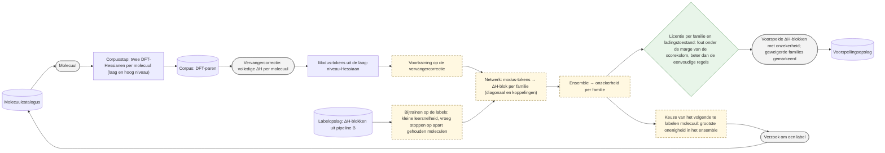
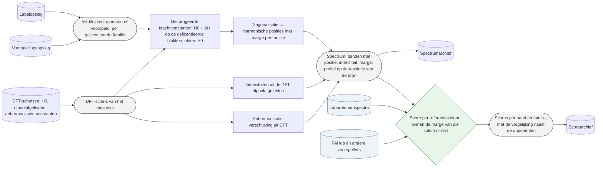
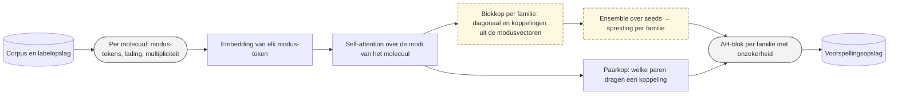

# Doelarchitectuur plan 05 (voor de auteurs, Nederlands; eerste versie 19 september 2026, herzien 20 september)

**Wat dit is.** Het systeem zoals het er staat als de lopende toetsen ja zeggen. Het is uitdrukkelijk *niet* het onderzoeksproces: er staan geen beslissingen in die de auteurs de komende dagen of weken nemen, geen ankerrun, geen experimentnummers, geen data. Dat proces krijgt zijn eigen blad. Rekenplaats staat er voorlopig ook niet in; die wordt later per blokje toegevoegd.

**Legenda (afgesproken 20 september).**

| figuur | betekenis |
|---|---|
| rechthoek | processtap: een bewerking die data omzet in andere data |
| rechthoek met ronde uiteinden (grijs) | data-object: een invoer, tussenproduct of uitkomst die door de pijplijn stroomt |
| cilinder | opslag: een verzameling die blijft bestaan en door meerdere stappen wordt gelezen of gevuld; blauw = extern, niet van ons |
| ruit (groen) | poort: een toets met een vooraf vastgelegde uitkomst — door, of niet door |
| doorgetrokken rand | bestaat en is gemeten |
| gestippelde rand, gele vulling | nog niet gebouwd |
| pijl | datastroom |

Elke pijplijn begint bij een opslag → data-object en eindigt bij data-object → opslag. Bron van waarheid: de `.mmd`-bestanden in deze map (Mermaid; renderen op GitHub).

## 0. Overzicht (niveau 2)

```mermaid
%% Doelarchitectuur plan 05 — overzicht (niveau 2). Het systeem zoals het staat als de toetsen ja zeggen.
%% Rechthoek = processtap; ronde uiteinden = data-object; cilinder = opslag; ruit = poort (toets met vaste uitkomst).
%% Doorgetrokken = bestaat; gestippeld = nog niet gebouwd. Pijlen zijn datastromen. Geen rekenplaats, geen besluiten.
flowchart LR
  classDef planned stroke-dasharray: 6 4,stroke:#7a5c00,fill:#fff8e1
  classDef ext fill:#eef3f8,stroke:#5b7a99
  classDef data fill:#f3f3f3,stroke:#666
  classDef gate fill:#e8f5e9,stroke:#2e7d32

  CAT[("Molecuulcatalogus: geometrieën, lading, multipliciteit")]
  MOL(["Molecuul"]):::data

  subgraph B["Pipeline B: hoe één label ontstaat"]
    direction TB
    DFT["DFT-schets: Hessiaan H0, modi, frequenties, families"]
    DECK["Deck: symmetrie-geblokte verplaatsingspatronen"]
    LNO["Coupled-cluster-energieën en -gradiënten in bevroren lokale ruimtes"]
    REC["Herstel van de correctie ΔH per bandfamilie: diagonaal en koppelingen"]
    LIC1{"Licentie van het herstel tegen direct berekende referenties"}:::gate
    DFT --> DECK --> LNO --> REC --> LIC1
  end
  LAB1(["Label: ΔH-blokken met foutmarge per familie"]):::data
  LABELS[("Labelopslag")]

  subgraph A["Pipeline A: het netwerk dat de correctie overdraagt"]
    direction TB
    CORPUS[("Corpus: DFT-paren per molecuul")]
    PROXY(["Vervangercorrectie: volledige ΔH per molecuul"]):::data
    PRE["Voortraining op de vervangercorrectie"]:::planned
    NET["Netwerk: modus-tokens → ΔH-blok per familie"]:::planned
    ENS["Ensemble → onzekerheid per familie"]:::planned
    LIC2{"Licentie per bandfamilie tegen de labels; anders weigering"}:::gate
    CORPUS --> PROXY --> PRE --> NET --> ENS --> LIC2
  end
  PRED(["Voorspelde ΔH-blokken met onzekerheid; geweigerde families gemarkeerd"]):::data
  PREDS[("Voorspellingsopslag")]

  subgraph S["Spectrum en score"]
    direction TB
    CORR["Gecorrigeerde krachtconstanten: H0 + ΔH op gelicentieerde blokken"]
    DIAG["Diagonalisatie → bandposities; intensiteiten en anharmoniek uit DFT"]
    SCORE["Scorebord per referentiekolom met eigen marge"]
    CORR --> DIAG
  end
  SPEC(["Spectrum met foutmarge per band"]):::data
  SPECS[("Spectrumarchief")]
  RES(["Scores per band en familie"]):::data
  RESS[("Scorearchief")]

  LABDB[("Laboratoriumspectra")]:::ext
  PAHDB[("PAHdb en andere voorspellers")]:::ext

  CAT --> MOL
  MOL --> DFT
  MOL --> CORPUS
  LIC1 --> LAB1 --> LABELS
  LABELS --> NET
  LABELS -- "foutmarge per familie" --> LIC2
  LIC2 --> PRED --> PREDS
  LABELS --> CORR
  PREDS --> CORR
  DFT --> CORR
  DIAG --> SPEC --> SPECS
  SPEC --> SCORE
  LABDB --> SCORE
  PAHDB --> SCORE
  SCORE --> RES --> RESS
```

## 1. Pipeline B: hoe één label ontstaat

```mermaid
%% Doelarchitectuur — Pipeline B: hoe één label ontstaat (niveau 3).
%% Rechthoek = processtap; ronde uiteinden = data-object; cilinder = opslag; ruit = poort. Gestippeld = nog niet gebouwd.
flowchart LR
  classDef planned stroke-dasharray: 6 4,stroke:#7a5c00,fill:#fff8e1
  classDef data fill:#f3f3f3,stroke:#666
  classDef gate fill:#e8f5e9,stroke:#2e7d32

  CAT[("Molecuulcatalogus")]
  GEO(["Molecuul: geoptimaliseerde geometrie, lading, multipliciteit"]):::data
  H0["Stage A: DFT-Hessiaan H0 → modi L, frequenties, families, irreps"]
  SKETCH(["DFT-schets"]):::data
  SYM["Symmetrieprior: koppeling alleen binnen een irrep-blok"]
  PAT["Patronen: gradiëntrichtingen voor de koppelingen, ±q langs enkele modi voor de diagonaal"]
  DECK(["Deck"]):::data
  REF["Referentieruimtes op x0: lokale orbitalen en fragmentruimtes, één keer gebouwd en verzegeld"]
  TRANS["Transport van de ruimtes naar elke deckgeometrie"]
  EN["Coupled-cluster-energieën in de bevroren ruimtes"]
  GR["Coupled-cluster-gradiënten in de bevroren ruimtes"]:::planned
  OPEN["Open-schil-variant voor kationen"]:::planned
  RESP(["Responsen: energieën en gradiënten per patroon, met ruis"]):::data
  SOLVE["Oplossing per familieblok: diagonaal en koppelingen"]
  BUDGET["Foutbudget per familie: ruis, quartische term, herstelfout"]
  LIC{"Licentie tegen direct berekende referenties"}:::gate
  LABEL(["Label: ΔH-blokken met foutmarge per familie"]):::data
  STORE[("Labelopslag")]

  CAT --> GEO --> H0 --> SKETCH --> SYM --> PAT --> DECK
  SKETCH --> REF --> TRANS
  DECK --> TRANS
  TRANS --> EN --> RESP
  TRANS --> GR --> RESP
  TRANS --> OPEN --> RESP
  RESP --> SOLVE --> LIC
  RESP --> BUDGET --> LIC
  LIC --> LABEL --> STORE
```

## 2. Pipeline A: het netwerk dat de correctie overdraagt

## 3. Spectrum en score

## 4. Componenten van het netwerk

