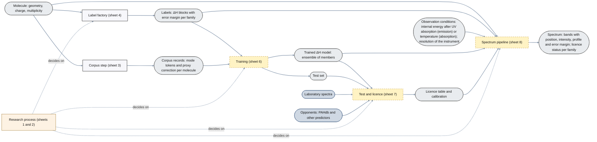
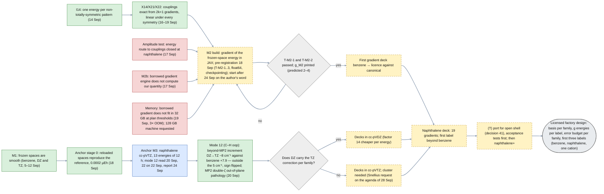
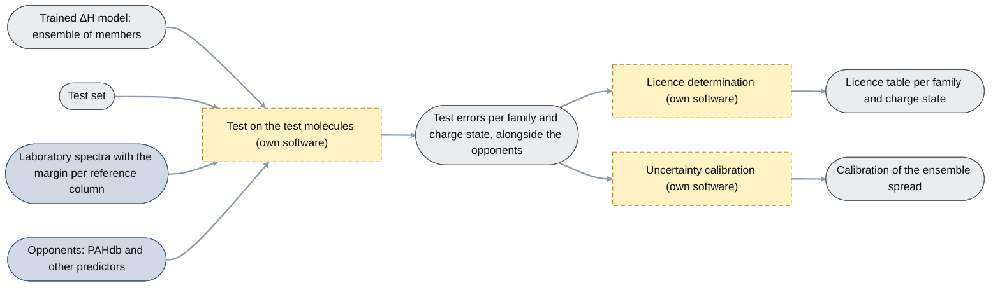

# Architecture of plan 05 (for the authors; first version 19 September 2026, revised 20 September; English since 21 September, translated from the Dutch original without changes of content)

**Four kinds of diagram, kept apart (agreement of 20 September).**

| kind | what it shows | sheets |
|---|---|---|
| **Data creation** | processes that make data: the corpus step (DFT pairs and proxy correction; sheet 3) and the label factory (coupled-cluster corrections per molecule; sheet 4) | 3, 4 |
| **The ΔH model** | the definition of the network: the components (sheet 5) and the same definition as PyTorch code (sheet 5b) | 5, 5b |
| **Training and assessment** | training: from corpus records and labels comes the trained ΔH model (sheet 6); test and licence: from that model and the test set come the licence table and the calibration, with the score against the laboratory columns and the opponents (sheet 7); the weights no longer change there. The spectrum pipeline uses the trained model of sheet 6 and the table and calibration of sheet 7; on sheet 8 itself those are not drawn as input objects (agreement 20 September); the measured label is drawn there, as the second source of ΔH next to the model (agreement 20 September, evening). Sheet 6 runs per model version, not per molecule, and contains the validation loop | 6, 7 |
| **Spectrum pipeline** | molecule and observation conditions in, spectrum with error margin and licence status out; ΔH from two sources — the measured label of sheet 4 (exists for the molecules with a label) or the ΔH model (for all others) — and one shared tail (H = H₀ + ΔH, VPT2, intensities, profile) | 8 |
| **Research process** | the tests that decide whether all of this gets built this way; the only kind of sheet in which data, decisions and experiment numbers are allowed | 1, 2 |

The overview (sheet 0) shows the kinds of process and the data objects that connect them. **Numbering (20 September):** the file numbers follow the order in which the steps are traversed: first the research process that decides on the rest (1, 2), then corpus (3), labels (4), the ΔH model (5, code 5b), training (6), test and licence (7), spectrum pipeline (8). Compute location is not in yet; it comes later per box.

**Drawing rules (agreed 19–20 September; applied on all sheets).**

| rule | content |
|---|---|
| shapes | rectangle = process step; rectangle with rounded ends (grey) = data object; darker blue = external data object, not ours; light frame around several figures = part of the ΔH model (backbone, heads; sheet 5 only) |
| step → object | every process step yields exactly one data object, which feeds the next step(s); a process begins and ends at a data object; branches only come out of data objects |
| naming | a step is named after the operation with the software package in brackets ("DFT (psi4)", "VPT2 (pyVPT2 on pyscf Hessians)") or "own software" / "PyTorch" when we make it; a data object is named after the thing; no word repetition between step and object; no explanation in captions |
| the model | the network is called **the ΔH model** (it predicts ΔH blocks per family); its shared part is called the **backbone** (embedding and self-attention), its outputs are called **heads** (block head, pair head); the instances with different seeds form the **ensemble** and are called **members**; the simple rules are the **baseline**. "Network" on its own does not occur on the target sheets (agreement 20 September) |
| noise principle | every derived quantity (curvature, coupling, anharmonic constant) gets an independent second route or a symmetry check, and the difference is a term of the error budget; on sheet 4 as its own step ("Consistency check"), on sheet 8 in the data object of the anharmonic constants (agreement 21 September, after the benzene VPT2: two routes to the same quartic constant differed by up to 1,265 cm⁻¹ and the package did not see it) |
| status | solid = exists and has been measured; dashed border, yellow fill = not built yet |
| none | no storage figures (cylinders), no diamonds on the target sheets (decisions per item sit inside a step), no invisible helper nodes: standard Mermaid, left to right |
| check | rendered locally before a commit (Mermaid 11), then the GitHub view |

On the research-process sheets (1, 2) their own colours apply: green = passed, blue = running, dashed = still to do, red = lost and closed; diamonds and data are allowed there. Source of truth: the `.mmd` files in this folder (Mermaid; rendered on GitHub).

## 0. Overview: the kinds of process and their data objects (`00_overview.mmd`)

# Research process (may contain data and decisions)

## 1. Research process — the label factory and the decks (`10_research_process_label_factory.mmd`; pipeline B in the proposal)

## 2. Research process — the ΔH model (`20_research_process_deltaH_model.mmd`; pipeline A in the proposal)

```mermaid
%% Research process — the ΔH model (in the proposal: pipeline A): the tests that decide whether and how the ΔH model of sheets 5 and 6 gets built; the end object is the licensed model design with the first licence table, not the trained model (sheet 6 makes that) and not the licence table of the full test set (sheet 7). Status 20 September 2026.
%% This sheet may contain data and decisions. Green = passed or measured; blue = running; dashed = still to do; red = lost and closed.
flowchart LR
  linkStyle default stroke:#8a9bb0,stroke-width:2.2px
  classDef done fill:#d9f0dc,stroke:#2e7d32,color:#111
  classDef running fill:#dbe9ff,stroke:#2a5db0,color:#111
  classDef todo stroke-dasharray: 6 4,stroke:#b8860b,fill:#fff3c4,color:#111
  classDef closed fill:#f6d5d5,stroke:#a33,color:#111
  classDef dec fill:#eee,stroke:#444,color:#111
  classDef data fill:#e9ecef,stroke:#555,color:#111

  LA["Layer A of the corpus: 45 molecules, DFT pairs (18–19 Sep, Helsinki)"]:::done
  LC1["Learning curves 1 and 2: C–H families below 5 cm-1 at 5–20 molecules; ring family at 12.4, flat; features do not help (19 Sep)"]:::done
  E4["E4: the per-mode label is ill-posed for the ring family (9.2 of the 12.4 is definition); the family block transfers (19 Sep)"]:::done
  RULE["Rule: the target object is the family block, diagonal + couplings (recipe amendment 19 Sep)"]:::done
  E1["E1/E1b/E2/E5/E5b: contrastive embedding, atom encoder, molecule tokens, skip-gram on the coupling matrix — all lost on 45 molecules (19 Sep)"]:::closed
  E6["E6 phase 1: layer A2, 200 molecules on four machines (since 19 Sep 23:30; done ~Wednesday)"]:::running
  D1{"Slope of the ring family over 45 → 200 steeper than −0.25?"}:::dec
  P2["E6 phase 2: the remaining 668 molecules (~€160)"]:::todo
  BHH["Proxy check: BHHLYP − B3LYP on benzene and naphthalene — is the proxy's ring correction non-local?"]:::todo
  ST1["Design step 1: equivariant pair-block model learns the full correction matrix from the corpus; Test 1: ring family below 5 cm-1 on the same 12 molecules"]:::todo
  E3["E3: pretext task with DFT quantities (frequency, family, sign) from raw atomic fields, on the whole corpus"]:::todo
  CC["First CC labels from the label factory (benzene, naphthalene; then the decks of M2)"]:::todo
  FT["Fine-tuning on the CC projections; licence per family against X18 and the median rule"]:::todo
  D2{"Per family: error below the margin of the score column?"}:::dec
  LICF["Family licensed in the network"]:::todo
  REF["Family refused: DFT with notice; next label chosen on disagreement"]:::todo
  OUT(["Licensed model design: target object (family block), representation with which the ring family learns, number of labels needed per family, pre-training recipe on the corpus; first licence table per family"]):::data

  LA --> LC1 --> E4 --> RULE
  LC1 --> E1 --> E6
  E4 --> E6
  E6 --> D1
  D1 -- yes --> P2 --> ST1
  D1 -- no --> BHH --> ST1
  RULE --> ST1
  E1 --> E3 --> ST1
  ST1 --> FT
  CC --> FT --> D2
  D2 -- yes --> LICF --> OUT
  D2 -- no --> REF --> CC
  REF --> OUT
```

# Target architecture (no data, no decisions)

## 3. Data creation — the corpus (`30_data_creation_corpus.mmd`)

```mermaid
%% Data creation — the corpus: two DFT Hessians per molecule and the proxy correction (level 3). Target architecture.
%% Rectangle = process step (operation + software); rounded ends = data object (the thing). Every step yields one data object. Everything exists.
flowchart LR
  linkStyle default stroke:#8a9bb0,stroke-width:2.2px
  classDef data fill:#e9ecef,stroke:#555,color:#111

  MOL(["Molecule: SMILES or geometry, charge, multiplicity"]):::data
  OPT["Geometry optimisation at low level (psi4)"]
  GEO(["Optimised geometry"]):::data
  DFTL["DFT at low level (psi4)"]
  SK(["Hessian H0 and dipole derivatives"]):::data
  DFTH["DFT at high level (psi4)"]
  H1(["Hessian H1"]):::data
  MODE["Mode analysis (own software)"]
  MODES(["Normal modes: L, frequencies, families, symmetry blocks"]):::data
  PROXY["Proxy correction (own software)"]
  DHP(["Proxy correction: ΔH = H1 − H0 per family block, in the mode basis"]):::data
  TOKS["Tokenisation (own software)"]
  TOK(["Mode tokens"]):::data
  REC["Record assembly (own software)"]
  CORP(["Corpus record: mode tokens, proxy correction, Hessian H0 and dipole derivatives"]):::data

  MOL --> OPT --> GEO
  GEO --> DFTL --> SK --> MODE --> MODES
  GEO --> DFTH --> H1
  SK --> PROXY
  H1 --> PROXY
  MODES --> PROXY --> DHP --> REC
  MODES --> TOKS --> TOK --> REC
  SK --> REC
  REC --> CORP
```

## 4. Data creation — the label factory: how one label comes about (`40_data_creation_labels.mmd`)

```mermaid
%% Data creation — the label factory: how one label comes about (level 3). Target architecture: no decisions, no data.
%% Rectangle = process step (operation + software); rounded ends = data object (the thing). Every step yields one data object. Dashed = not built yet.
flowchart LR
  linkStyle default stroke:#8a9bb0,stroke-width:2.2px
  classDef planned stroke-dasharray: 6 4,stroke:#b8860b,fill:#fff3c4,color:#111
  classDef data fill:#e9ecef,stroke:#555,color:#111

  MOL(["Molecule: geometry, charge, multiplicity"]):::data
  DFT["DFT (psi4)"]
  SK(["Hessian H0 and dipole derivatives"]):::data
  MODE["Mode analysis (own software)"]
  MODES(["Normal modes: L, frequencies, families, symmetry blocks"]):::data
  DESIGN["Deck design (own software)"]
  DECK(["Deck: displacement patterns per family block, with energy and gradient directions"]):::data
  LOC["Localisation and fragmentation at the equilibrium geometry (pyscf-forge)"]
  REF(["Frozen reference spaces: local orbitals and fragment spaces"]):::data
  TRANS["Transport (own software)"]
  SPACES(["Reference spaces at every deck geometry"]):::data
  EN["LNO-CCSD(T) energies (pyscf-forge)"]
  ENS(["Energies per pattern"]):::data
  GR["LNO-CCSD(T) gradients (own software, JAX)"]:::planned
  GRS(["Gradients per pattern"]):::data
  OPEN["LNO-CCSD(T) for open shell (own (T) port in C)"]:::planned
  OPENS(["Energies per pattern for cations"]):::data
  SOLVE["Block solve (own software)"]
  DH(["ΔH blocks per family: diagonal and couplings"]):::data
  CHECK["Consistency check (own software)"]
  NOISE(["Noise term per quantity: difference between two routes or between symmetry partners"]):::data
  BUDGET["Error budget (own software)"]
  MARG(["Error margin per family: noise, quartic term, recovery error"]):::data
  CUB(["Cubic constants of the low level (from the VPT2 step of sheet 8)"]):::data
  GEO["Geometry term (own software)"]
  GTERM(["Geometry term per mode: first-order shift towards the high-level minimum, from the ± energies along the totally symmetric modes and the low-level cubic constants, with noise term"]):::data
  SEAL["Sealing (own software)"]
  LABEL(["Label: ΔH blocks with error margin per family and geometry term per mode, sealed"]):::data

  MOL --> DFT --> SK --> MODE --> MODES --> DESIGN --> DECK
  SK --> LOC --> REF
  REF --> TRANS
  DECK --> TRANS --> SPACES
  SPACES --> EN --> ENS
  SPACES --> GR --> GRS
  SPACES --> OPEN --> OPENS
  ENS --> SOLVE
  GRS --> SOLVE
  OPENS --> SOLVE
  SOLVE --> DH --> SEAL
  ENS --> GEO
  CUB --> GEO --> GTERM --> SEAL
  ENS --> CHECK
  GRS --> CHECK
  CHECK --> NOISE --> BUDGET
  ENS --> BUDGET
  GRS --> BUDGET
  BUDGET --> MARG --> SEAL
  SEAL --> LABEL
```

## 5. Components of the ΔH model (`50_deltaH_model_components.mmd`)

```mermaid
%% Components of the ΔH model (level 4): what happens inside the step "Forward pass (ΔH model, PyTorch)" of sheet 8 (the spectrum pipeline). Backbone = embedding and self-attention; heads = block head and pair head; the ensemble consists of members with different seeds. Target architecture; largely not built yet.
%% Rectangle = process step (operation + software); rounded ends = data object (the thing). Every step yields one data object. Dashed = not built yet.
flowchart LR
  linkStyle default stroke:#8a9bb0,stroke-width:2.2px
  classDef planned stroke-dasharray: 6 4,stroke:#b8860b,fill:#fff3c4,color:#111
  classDef data fill:#e9ecef,stroke:#555,color:#111
  classDef part fill:#f7f7fb,stroke:#333,stroke-width:1.5px,color:#111

  TOK(["Mode tokens of one molecule, with charge and multiplicity"]):::data
  EMB["Embedding (PyTorch)"]
  EMBV(["Token vectors"]):::data
  ATT["Self-attention over the modes (PyTorch)"]
  CTX(["Context vectors per mode"]):::data
  BLK["Block head (PyTorch)"]:::planned
  BLKS(["ΔH blocks per family of one ensemble member"]):::data
  PAIR["Pair head (PyTorch)"]
  PAIRS(["Support labels per mode pair"]):::data
  ENSA["Ensemble averaging over the members (own software)"]:::planned
  OUT(["ΔH blocks per family, with ensemble uncertainty"]):::data

  subgraph BB["Backbone of the ΔH model"]
    EMB
    EMBV
    ATT
    CTX
  end
  subgraph HD["Heads of the ΔH model"]
    BLK
    PAIR
  end
  class BB,HD part

  TOK --> EMB --> EMBV --> ATT --> CTX
  CTX --> BLK --> BLKS --> ENSA --> OUT
  CTX --> PAIR --> PAIRS --> ENSA
```

## 5b. The ΔH model in code (`51_deltaH_model_pytorch.py`)

Sheet 5 as a PyTorch definition, added 20 September: input layer (`TokenEmbedding`: mode tokens through a two-layer MLP, charge and multiplicity as two molecule tokens in front, no positional encoding because modes are a set), hidden layers (`Backbone`: Transformer encoder, two layers, four heads, width 64, dropout 0.1, pre-LayerNorm, with padding mask), output layers (`BlockHead`: the ΔH block per family in the mode basis, diagonal from the context vector and couplings from symmetric pair features, zero outside the family; `PairHead`: support logit per mode pair), plus what standardly belongs around it: `DeltaHConfig`, initialisation, `block_loss` (block rule of 19 September, weighting per family from the error budget), `pair_loss` (class-weighted, lesson of E5), `DeltaHEnsemble` with mean and spread per element, parameter count and a smoke test on random input. No training loop: that belongs to sheet 6 and goes into `modules/05_support_predictor/` as soon as there are labels. Numbers follow the desk note of 18 September §1.

## 6. Training (`60_training.mmd`)

```mermaid
%% Training (level 3): from corpus records and labels comes the trained ΔH model. Target architecture; not built yet. The assessment (test, licence, calibration) is on sheet 7.
%% Rectangle = process step (operation + software); rounded ends = data object (the thing). Every step yields one data object. Dashed = not built yet.
flowchart LR
  linkStyle default stroke:#8a9bb0,stroke-width:2.2px
  classDef planned stroke-dasharray: 6 4,stroke:#b8860b,fill:#fff3c4,color:#111
  classDef data fill:#e9ecef,stroke:#555,color:#111

  CORP(["Corpus records: mode tokens and proxy correction per molecule"]):::data
  LAB(["Labels: ΔH blocks with error margin per family"]):::data
  SPLIT["Split per molecule and per core (own software)"]:::planned
  SETS(["Training, validation and test sets"]):::data
  PRE["Pre-training on the proxy correction (PyTorch)"]:::planned
  PRENET(["Pre-trained ΔH model"]):::data
  FT["Fine-tuning on the labels (PyTorch)"]:::planned
  FTNET(["Fine-tuned ΔH model"]):::data
  VAL["Validation against the simple rules (own software)"]:::planned
  VALR(["Validation errors per family"]):::data
  ENSF["Ensemble formation over seeds (PyTorch)"]:::planned
  ENS(["Trained ΔH model: ensemble of members"]):::data

  CORP --> SPLIT
  LAB --> SPLIT
  SPLIT --> SETS
  SETS --> PRE --> PRENET --> FT --> FTNET --> ENSF --> ENS
  SETS --> FT
  FTNET --> VAL --> VALR --> FT
```

## 7. Test and licence (`70_test_and_licence.mmd`)

## 8. Spectrum pipeline (`80_spectrum_pipeline.mmd`)

```mermaid
%% Spectrum pipeline (level 3): molecule in, spectrum with error margin out. ΔH comes from two sources: measured (the label of sheet 4, for molecules with a label) or predicted (the ΔH model, for all others); the tail is the same. Target architecture.
%% Rectangle = process step (operation + software); rounded ends = data object (the thing). Every step yields one data object. Dashed = not built yet.
flowchart LR
  linkStyle default stroke:#8a9bb0,stroke-width:2.2px
  classDef planned stroke-dasharray: 6 4,stroke:#b8860b,fill:#fff3c4,color:#111
  classDef data fill:#e9ecef,stroke:#555,color:#111

  MOL(["Molecule: geometry, charge, multiplicity"]):::data
  COND(["Observation conditions: internal energy after UV absorption (emission) or temperature (absorption); resolution of the instrument"]):::data

  DFT["DFT (psi4)"]
  SK(["Hessian H0 and dipole derivatives"]):::data
  VPT["VPT2 (pyVPT2 on pyscf Hessians)"]
  ANHC(["Anharmonic constants, with route difference per constant"]):::data
  MODE["Mode analysis (own software)"]
  MODES(["Normal modes: L, frequencies, families, symmetry blocks"]):::data
  TOKS["Tokenisation (own software)"]
  TOK(["Mode tokens"]):::data
  FWD["Forward pass (ΔH model, PyTorch)"]:::planned
  DH(["ΔH blocks per family and relaxation along the totally symmetric modes, with ensemble uncertainty"]):::data
  LAB(["Label from the label factory: ΔH blocks with error margin per family and geometry term per mode"]):::data
  LICF["Licence filter (own software)"]:::planned
  DHL(["Applied and refused ΔH blocks, with reason"]):::data
  APPLY["Assembly of H (own software)"]
  H(["Force constants H = H0 + ΔH on licensed blocks, H0 elsewhere; licence status per family"]):::data
  EIG["Diagonalisation (own software)"]
  POS(["Band positions with margin and licence status per family"]):::data
  GEOP["Geometry term (own software)"]
  POSG(["Band positions with geometry term, margin and licence status per family"]):::data
  INT["Intensity calculation (own software)"]
  INTS(["Band intensities, redistributed over resonance polyads"]):::data
  ANH["Anharmonic correction (own software)"]
  ANHS(["Anharmonic shifts per band"]):::data
  SHAPE["Profile formation (own software)"]

  SPEC(["Spectrum: bands with position, intensity, profile and error margin; licence status per family"]):::data

  MOL --> DFT --> SK
  SK --> MODE --> MODES
  SK --> VPT --> ANHC
  MODES --> TOKS --> TOK --> FWD --> DH --> LICF --> DHL --> APPLY --> H --> EIG --> POS --> GEOP --> POSG --> SHAPE
  DHL --> GEOP
  ANHC --> GEOP
  LAB --> LICF
  SK --> APPLY
  SK --> INT
  MODES --> INT --> INTS --> SHAPE
  ANHC --> ANH
  ANHC --> INT
  MODES --> ANH --> ANHS --> SHAPE
  COND --> SHAPE
  SHAPE --> SPEC
```

