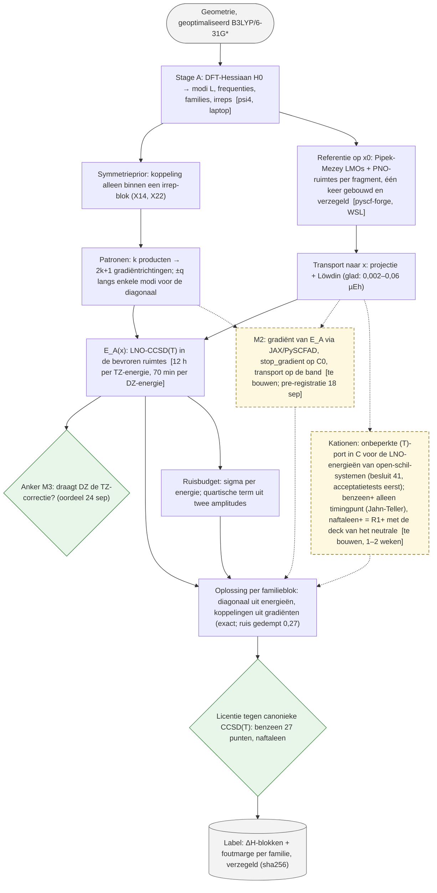
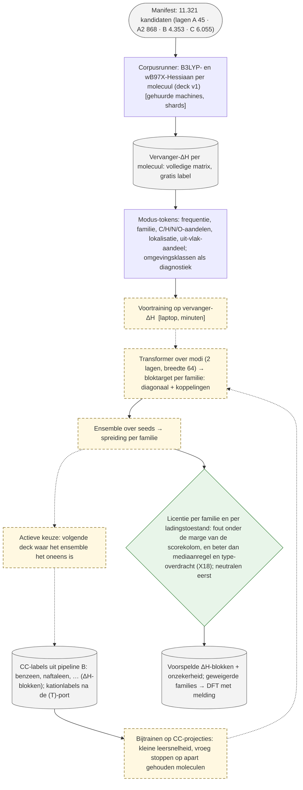
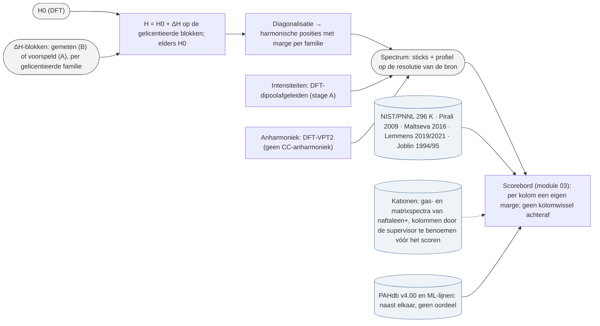
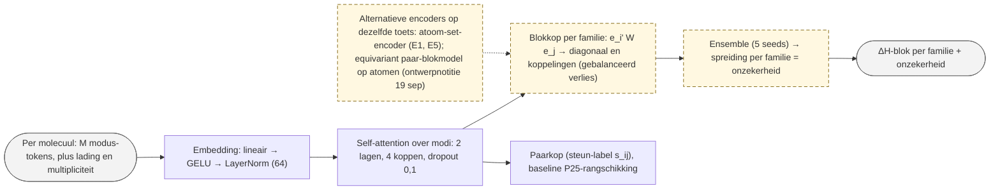

# Architectuur plan 05 — stand 19 september 2026 (eerste versie; voor de auteurs, Nederlands)

Bron van waarheid: de `.mmd`-bestanden in deze map (Mermaid; renderen op GitHub en in de blog). Doorgetrokken = gemeten of bestaand; gestippeld = te bouwen; rekenplaats tussen haken; stromen zijn data. Gesloten routes staan er niet in (besluit van de auteurs, 19 september). Kationen toegevoegd 19 september, gestippeld (besluit 41: de (T)-port; R1+ naftaleen+; kationkolommen nog te benoemen). Wijzigingen gedateerd, zoals alles hier.

## 0. Overzicht (niveau 2)

```mermaid
%% Architectuur plan 05 — overzicht (niveau 2), stand 19 september 2026.
%% Doorgetrokken = gemeten/bestaat; gestippeld = te bouwen. Stromen zijn data. Rekenplaats tussen haken.
flowchart LR
  classDef planned stroke-dasharray: 6 4,stroke:#7a5c00,fill:#fff8e1
  classDef ext fill:#eef3f8,stroke:#5b7a99
  classDef data fill:#f3f3f3,stroke:#666
  classDef gate fill:#e8f5e9,stroke:#2e7d32

  MOL(["Molecuul: geometrie + lading"]):::data

  subgraph B["Pipeline B: hoe één label ontstaat  [laptop / gehuurde machine]"]
    direction TB
    DFT["DFT-schets: B3LYP/6-31G* Hessiaan H0, modi L, frequenties"]
    DECK["Deck: symmetrie-geblokte verplaatsingspatronen (2k+1 gradiënten; energieën voor de diagonaal)"]
    LNO["Bevroren lokale CC-ruimtes: LNO-CCSD(T)-energieën langs de patronen"]
    GRAD["M2: gradiënten van de bevroren-ruimte-energieën (JAX)"]:::planned
    CAT["Kationen: onbeperkte (T)-port voor open schil (besluit 41); zelfde deck; R1+ = naftaleen+"]:::planned
    REC["Herstel van de correctie ΔH per bandfamilie (diagonaal + koppelingen)"]
    LIC1{"Licentie: exact tegen direct berekende referentie (benzeen, naftaleen)"}:::gate
    DFT --> DECK --> LNO --> REC
    DECK -.-> GRAD -.-> REC
    LNO -.-> CAT -.-> REC
    REC --> LIC1
  end

  LABELS[("Labels: ΔH-blokken per molecuul, met ruis en foutmarge")]:::data

  subgraph A["Pipeline A: het netwerk dat de correctie overdraagt  [laptop / gehuurde machine]"]
    direction TB
    CORP["Corpus: DFT-paren (B3LYP, wB97X) — 45 gedaan, 868 lopend, 11.321 mogelijk"]
    PRE["Voortraining op de vervanger-ΔH (volledige matrices)"]:::planned
    NET["Netwerk: modus-tokens + lading/multipliciteit → bloktarget per familie; neutraal gelicentieerd tot er kationlabels zijn"]:::planned
    ENS["Ensemble over seeds → onzekerheid per familie"]:::planned
    LIC2{"Licentie per bandfamilie tegen de labels; anders weigering met melding"}:::gate
    CORP --> PRE -.-> NET --> ENS --> LIC2
  end

  subgraph S["Spectrum en score  [laptop]"]
    direction TB
    CORR["Gecorrigeerde krachtconstanten H0 + ΔH op gelicentieerde families; DFT elders"]
    DIAG["Diagonalisatie → bandposities; intensiteiten uit DFT-dipoolafgeleiden; anharmoniek uit DFT"]
    SPEC(["Spectrum met foutmarge per band"]):::data
    SCORE["Scorebord per referentiekolom: Pirali 0,5 · Maltseva ~1 · FEL 5–17 cm-1; kationkolommen (gas/matrix naftaleen+) nog te benoemen"]
    CORR --> DIAG --> SPEC --> SCORE
  end

  LAB[("Laboratoriumspectra: NIST/PNNL, Pirali 2009, Maltseva 2016, Lemmens 2019/2021")]:::ext
  PAHDB[("PAHdb v4.00: geschaalde DFT-spectra (vergelijking, geen oordeel)")]:::ext
  JWST(["Astronomische banden (JWST): de vraag"]):::ext

  MOL --> DFT
  MOL --> CORP
  LIC1 --> LABELS --> NET
  LABELS -. "foutmarge per familie" .-> LIC2
  LIC2 --> CORR
  DFT --> CORR
  LAB --> SCORE
  PAHDB --> SCORE
  SCORE --> JWST
```

## 1. Pipeline B: hoe één label ontstaat

## 2. Pipeline A: het netwerk dat de correctie overdraagt

## 3. Spectrum en score

## 4. Componenten van het netwerk

