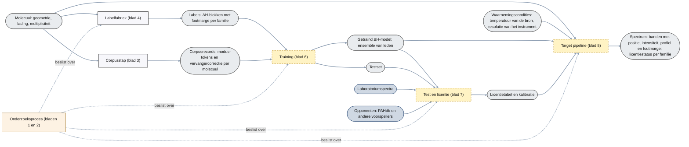
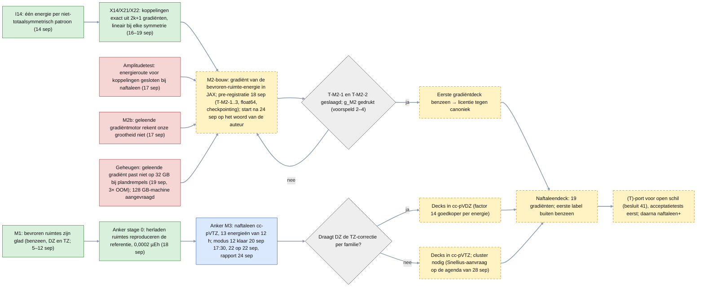

# Architectuur plan 05 (voor de auteurs, Nederlands; eerste versie 19 september 2026, herzien 20 september)

**Vier soorten diagram, uit elkaar gehouden (afspraak van 20 september).**

| soort | wat het toont | bladen |
|---|---|---|
| **Datacreatie** | processen die data maken: de corpusstap (DFT-paren en vervangercorrectie; blad 3) en de labelfabriek (coupled-cluster-correcties per molecuul; blad 4) | 3, 4 |
| **Het ΔH-model** | de definitie van het netwerk: de componenten (blad 5) en dezelfde definitie als PyTorch-code (blad 5b) | 5, 5b |
| **Training en beoordeling** | training: uit corpusrecords en labels komt het getrainde ΔH-model (blad 6); test en licentie: uit dat model en de testset komen de licentietabel en de kalibratie, met de score tegen de laboratoriumkolommen en de opponenten (blad 7); de gewichten veranderen daar niet meer. De target pipeline gebruikt het getrainde model van blad 6 en de tabel en kalibratie van blad 7; op blad 8 zelf staan die niet als invoerobject getekend (afspraak 20 september). Blad 6 draait per modelversie, niet per molecuul, en bevat de validatielus | 6, 7 |
| **Target pipeline** | het eindproduct: molecuul en waarnemingscondities in, forward pass van het ΔH-model als één stap, spectrum met licentiestatus uit | 8 |
| **Onderzoeksproces** | de toetsen die beslissen of dit alles er zo komt; het enige soort blad waar data, besluiten en experimentnummers in mogen | 1, 2 |

Het overzicht (blad 0) toont de soorten proces en de data-objecten die ze verbinden. **Nummering (20 september):** de bestandsnummers volgen de volgorde waarin de stappen worden doorlopen: eerst het onderzoeksproces dat over de rest beslist (1, 2), dan corpus (3), labels (4), het ΔH-model (5, code 5b), training (6), test en licentie (7), target pipeline (8). Rekenplaats staat er voorlopig niet in; die komt later per blokje.

**Tekenregels (afgesproken 19–20 september; op alle bladen toegepast).**

| regel | inhoud |
|---|---|
| vormen | rechthoek = processtap; rechthoek met ronde uiteinden (grijs) = data-object; donkerder blauw = extern data-object, niet van ons; licht kader om meerdere figuren = onderdeel van het ΔH-model (backbone, koppen; alleen blad 5) |
| stap → object | elke processtap levert precies één data-object, dat de volgende stap(pen) voedt; een proces begint en eindigt bij een data-object; splitsingen komen alleen uit data-objecten |
| naamgeving | een stap heet naar de bewerking met tussen haken het softwarepakket ("DFT (psi4)", "VPT2 (pyVPT2 op psi4)") of "eigen software" / "PyTorch" als wij het maken; een data-object heet naar het ding; geen woordherhaling tussen stap en object; geen uitleg in captions |
| het model | het netwerk heet **het ΔH-model** (het voorspelt ΔH-blokken per familie); zijn gedeelde deel heet de **backbone** (embedding en self-attention), zijn uitgangen heten **koppen** (blokkop, paarkop); de exemplaren met verschillende seeds vormen het **ensemble** en heten **leden**; de eenvoudige regels zijn de **baseline**. "Netwerk" zonder meer komt op de doelbladen niet voor (afspraak 20 september) |
| status | doorgetrokken = bestaat en is gemeten; gestippelde rand, gele vulling = nog niet gebouwd |
| geen | geen opslagfiguren (cilinders), geen ruiten op de doelbladen (beslissingen per item zitten in een stap), geen onzichtbare hulpknopen: standaard Mermaid, links naar rechts |
| controle | vóór een commit lokaal gerenderd (Mermaid 11), daarna de GitHub-weergave |

Op de onderzoeksprocesbladen (1, 2) gelden eigen kleuren: groen = geslaagd, blauw = loopt, gestippeld = nog te doen, rood = verloren en gesloten; daar mogen ruiten en data in. Bron van waarheid: de `.mmd`-bestanden in deze map (Mermaid; renderen op GitHub).

## 0. Overzicht: de soorten proces en hun data-objecten (`00_overzicht.mmd`)

# Onderzoeksproces (mag data en besluiten bevatten)

## 1. Onderzoeksproces — de labelfabriek en de decks (`10_onderzoeksproces_labelfabriek.mmd`; in het voorstel pipeline B)

## 2. Onderzoeksproces — het ΔH-model (`20_onderzoeksproces_deltaH_model.mmd`; in het voorstel pipeline A)

```mermaid
%% Onderzoeksproces — het ΔH-model (in het voorstel: pipeline A): de toetsen die beslissen of en hoe het ΔH-model van de bladen 5 en 6 er komt. Stand 20 september 2026.
%% Dit blad mag data en besluiten bevatten. Groen = geslaagd of gemeten; blauw = loopt; gestippeld = nog te doen; rood = verloren en gesloten.
flowchart LR
  linkStyle default stroke:#8a9bb0,stroke-width:2.2px
  classDef done fill:#d9f0dc,stroke:#2e7d32,color:#111
  classDef running fill:#dbe9ff,stroke:#2a5db0,color:#111
  classDef todo stroke-dasharray: 6 4,stroke:#b8860b,fill:#fff3c4,color:#111
  classDef closed fill:#f6d5d5,stroke:#a33,color:#111
  classDef dec fill:#eee,stroke:#444,color:#111

  LA["Laag A van het corpus: 45 moleculen, DFT-paren (18–19 sep, Helsinki)"]:::done
  LC1["Leercurve 1 en 2: C–H-families onder 5 cm-1 bij 5–20 moleculen; ringfamilie op 12,4, vlak; kenmerken helpen niet (19 sep)"]:::done
  E4["E4: het label per modus is voor de ringfamilie slecht gesteld (9,2 van de 12,4 is definitie); het familieblok draagt over (19 sep)"]:::done
  RULE["Regel: het doelobject is het familieblok, diagonaal + koppelingen (recipe-amendement 19 sep)"]:::done
  E1["E1/E1b/E2/E5/E5b: contrastieve embedding, atoom-encoder, molecuultokens, skip-gram op de koppelingsmatrix — alle verloren op 45 moleculen (19 sep)"]:::closed
  E6["E6 fase 1: laag A2, 200 moleculen op vier machines (sinds 19 sep 23:30; ~woensdag klaar)"]:::running
  D1{"Helling van de ringfamilie over 45 → 200 steiler dan −0,25?"}:::dec
  P2["E6 fase 2: de resterende 668 moleculen (~€160)"]:::todo
  BHH["Vervangercontrole: BHHLYP − B3LYP op benzeen en naftaleen — is de ringcorrectie van de vervanger niet-lokaal?"]:::todo
  ST1["Stap 1 van het ontwerp: equivariant paar-blokmodel leert de volledige correctiematrix uit het corpus; Test 1: ringfamilie onder 5 cm-1 op dezelfde 12 moleculen"]:::todo
  E3["E3: voorwendsel met DFT-grootheden (frequentie, familie, teken) uit ruwe atoomvelden, op het hele corpus"]:::todo
  CC["Eerste CC-labels uit de labelfabriek (benzeen, naftaleen; daarna de decks van M2)"]:::todo
  FT["Bijtrainen op de CC-projecties; licentie per familie tegen X18 en de mediaanregel"]:::todo
  D2{"Per familie: fout onder de marge van de scorekolom?"}:::dec
  LICF["Familie gelicentieerd in het netwerk"]:::todo
  REF["Familie geweigerd: DFT met melding; volgende label gekozen op onenigheid"]:::todo

  LA --> LC1 --> E4 --> RULE
  LC1 --> E1 --> E6
  E4 --> E6
  E6 --> D1
  D1 -- ja --> P2 --> ST1
  D1 -- nee --> BHH --> ST1
  RULE --> ST1
  E1 --> E3 --> ST1
  ST1 --> FT
  CC --> FT --> D2
  D2 -- ja --> LICF
  D2 -- nee --> REF --> CC
```

# Doelarchitectuur (geen data, geen besluiten)

## 3. Datacreatie — het corpus (`30_datacreatie_corpus.mmd`)

```mermaid
%% Datacreatie — het corpus: twee DFT-Hessianen per molecuul en de vervangercorrectie (niveau 3). Doelarchitectuur.
%% Rechthoek = processtap (bewerking + software); ronde uiteinden = data-object (het ding). Elke stap levert één data-object. Alles bestaat.
flowchart LR
  linkStyle default stroke:#8a9bb0,stroke-width:2.2px
  classDef data fill:#e9ecef,stroke:#555,color:#111

  MOL(["Molecuul: SMILES of geometrie, lading, multipliciteit"]):::data
  OPT["Geometrieoptimalisatie op laag niveau (psi4)"]
  GEO(["Geoptimaliseerde geometrie"]):::data
  DFTL["DFT op laag niveau (psi4)"]
  SK(["Hessiaan H0 en dipoolafgeleiden"]):::data
  DFTH["DFT op hoog niveau (psi4)"]
  H1(["Hessiaan H1"]):::data
  MODE["Modusanalyse (eigen software)"]
  MODES(["Normaalmodi: L, frequenties, families, symmetrieblokken"]):::data
  PROXY["Vervangercorrectie (eigen software)"]
  DHP(["Vervangercorrectie: ΔH = H1 − H0 per familieblok, in de modusbasis"]):::data
  TOKS["Tokenisatie (eigen software)"]
  TOK(["Modus-tokens"]):::data
  REC["Samenstellen van het record (eigen software)"]
  CORP(["Corpusrecord: modus-tokens, vervangercorrectie, Hessiaan H0 en dipoolafgeleiden"]):::data

  MOL --> OPT --> GEO
  GEO --> DFTL --> SK --> MODE --> MODES
  GEO --> DFTH --> H1
  SK --> PROXY
  H1 --> PROXY
  MODES --> PROXY --> DHP --> REC
  MODES --> TOKS --> TOK --> REC
  SK --> REC
  REC --> CORP
```

## 4. Datacreatie — de labelfabriek: hoe één label ontstaat (`40_datacreatie_labels.mmd`)

```mermaid
%% Datacreatie — de labelfabriek: hoe één label ontstaat (niveau 3). Doelarchitectuur: geen besluiten, geen data.
%% Rechthoek = processtap (bewerking + software); ronde uiteinden = data-object (het ding). Elke stap levert één data-object. Gestippeld = nog niet gebouwd.
flowchart LR
  linkStyle default stroke:#8a9bb0,stroke-width:2.2px
  classDef planned stroke-dasharray: 6 4,stroke:#b8860b,fill:#fff3c4,color:#111
  classDef data fill:#e9ecef,stroke:#555,color:#111

  MOL(["Molecuul: geometrie, lading, multipliciteit"]):::data
  DFT["DFT (psi4)"]
  SK(["Hessiaan H0 en dipoolafgeleiden"]):::data
  MODE["Modusanalyse (eigen software)"]
  MODES(["Normaalmodi: L, frequenties, families, symmetrieblokken"]):::data
  DESIGN["Deckontwerp (eigen software)"]
  DECK(["Deck: verplaatsingspatronen per familieblok, met energie- en gradiëntrichtingen"]):::data
  LOC["Lokalisatie en fragmentatie op de rustgeometrie (pyscf-forge)"]
  REF(["Bevroren referentieruimtes: lokale orbitalen en fragmentruimtes"]):::data
  TRANS["Transport (eigen software)"]
  SPACES(["Referentieruimtes op elke deckgeometrie"]):::data
  EN["LNO-CCSD(T)-energieën (pyscf-forge)"]
  ENS(["Energieën per patroon"]):::data
  GR["LNO-CCSD(T)-gradiënten (eigen software, JAX)"]:::planned
  GRS(["Gradiënten per patroon"]):::data
  OPEN["LNO-CCSD(T) voor open schil (eigen (T)-port in C)"]:::planned
  OPENS(["Energieën per patroon voor kationen"]):::data
  SOLVE["Blokoplossing (eigen software)"]
  DH(["ΔH-blokken per familie: diagonaal en koppelingen"]):::data
  BUDGET["Foutbudget (eigen software)"]
  MARG(["Foutmarge per familie: ruis, quartische term, herstelfout"]):::data
  SEAL["Verzegeling (eigen software)"]
  LABEL(["Label: ΔH-blokken met foutmarge per familie, verzegeld"]):::data

  MOL --> DFT --> SK --> MODE --> MODES --> DESIGN --> DECK
  SK --> LOC --> REF
  REF --> TRANS
  DECK --> TRANS --> SPACES
  SPACES --> EN --> ENS
  SPACES --> GR --> GRS
  SPACES --> OPEN --> OPENS
  ENS --> SOLVE
  GRS --> SOLVE
  OPENS --> SOLVE
  SOLVE --> DH --> SEAL
  ENS --> BUDGET
  GRS --> BUDGET
  BUDGET --> MARG --> SEAL
  SEAL --> LABEL
```

## 5. Componenten van het ΔH-model (`50_deltaH_model_componenten.mmd`)

```mermaid
%% Componenten van het ΔH-model (niveau 4): wat er binnen de stap "Forward pass (ΔH-model, PyTorch)" van blad 8 gebeurt. Backbone = embedding en self-attention; koppen = blokkop en paarkop; het ensemble bestaat uit leden met verschillende seeds. Doelarchitectuur; grotendeels nog niet gebouwd.
%% Rechthoek = processtap (bewerking + software); ronde uiteinden = data-object (het ding). Elke stap levert één data-object. Gestippeld = nog niet gebouwd.
flowchart LR
  linkStyle default stroke:#8a9bb0,stroke-width:2.2px
  classDef planned stroke-dasharray: 6 4,stroke:#b8860b,fill:#fff3c4,color:#111
  classDef data fill:#e9ecef,stroke:#555,color:#111
  classDef part fill:#f7f7fb,stroke:#333,stroke-width:1.5px,color:#111

  TOK(["Modus-tokens van één molecuul, met lading en multipliciteit"]):::data
  EMB["Embedding (PyTorch)"]
  EMBV(["Tokenvectoren"]):::data
  ATT["Self-attention over de modi (PyTorch)"]
  CTX(["Contextvectoren per modus"]):::data
  BLK["Blokkop (PyTorch)"]:::planned
  BLKS(["ΔH-blokken per familie van één ensemblelid"]):::data
  PAIR["Paarkop (PyTorch)"]
  PAIRS(["Steunlabels per moduspaar"]):::data
  ENSA["Ensemblemiddeling over de leden (eigen software)"]:::planned
  OUT(["ΔH-blokken per familie, met onzekerheid van het ensemble"]):::data

  subgraph BB["Backbone van het ΔH-model"]
    EMB
    EMBV
    ATT
    CTX
  end
  subgraph HD["Koppen van het ΔH-model"]
    BLK
    PAIR
  end
  class BB,HD part

  TOK --> EMB --> EMBV --> ATT --> CTX
  CTX --> BLK --> BLKS --> ENSA --> OUT
  CTX --> PAIR --> PAIRS --> ENSA
```

## 5b. Het ΔH-model in code (`51_deltaH_model_pytorch.py`)

Blad 5 als PyTorch-definitie, toegevoegd 20 september: invoerlaag (`TokenEmbedding`: modustokens door een tweelaags MLP, lading en multipliciteit als twee molecuul-tokens ervoor, geen positionele codering omdat modi een verzameling zijn), verborgen lagen (`Backbone`: Transformer-encoder, twee lagen, vier heads, breedte 64, dropout 0.1, pre-LayerNorm, met opvulmasker), uitvoerlagen (`BlockHead`: het ΔH-blok per familie in de modusbasis, diagonaal uit de contextvector en koppelingen uit symmetrische paarkenmerken, nul buiten de familie; `PairHead`: steunlogit per moduspaar), plus wat er standaard omheen hoort: `DeltaHConfig`, initialisatie, `block_loss` (blokregel van 19 september, weging per familie uit het foutbudget), `pair_loss` (klassegewogen, les van E5), `DeltaHEnsemble` met gemiddelde en spreiding per element, parametertelling en een rooktest op willekeurige invoer. Geen trainingslus: die hoort bij blad 6 en komt in `modules/05_support_predictor/` zodra er labels zijn. Getallen volgen de desk-notitie van 18 september §1.

## 6. Training (`60_training.mmd`)

```mermaid
%% Training (niveau 3): uit corpusrecords en labels komt het getrainde ΔH-model. Doelarchitectuur; nog niet gebouwd. De beoordeling (test, licentie, kalibratie) staat op blad 7.
%% Rechthoek = processtap (bewerking + software); ronde uiteinden = data-object (het ding). Elke stap levert één data-object. Gestippeld = nog niet gebouwd.
flowchart LR
  linkStyle default stroke:#8a9bb0,stroke-width:2.2px
  classDef planned stroke-dasharray: 6 4,stroke:#b8860b,fill:#fff3c4,color:#111
  classDef data fill:#e9ecef,stroke:#555,color:#111

  CORP(["Corpusrecords: modus-tokens en vervangercorrectie per molecuul"]):::data
  LAB(["Labels: ΔH-blokken met foutmarge per familie"]):::data
  SPLIT["Splitsing per molecuul en per kern (eigen software)"]:::planned
  SETS(["Train-, validatie- en testsets"]):::data
  PRE["Voortraining op de vervangercorrectie (PyTorch)"]:::planned
  PRENET(["Voorgetraind ΔH-model"]):::data
  FT["Bijtraining op de labels (PyTorch)"]:::planned
  FTNET(["Bijgetraind ΔH-model"]):::data
  VAL["Validatie tegen de eenvoudige regels (eigen software)"]:::planned
  VALR(["Validatiefouten per familie"]):::data
  ENSF["Ensemblevorming over seeds (PyTorch)"]:::planned
  ENS(["Getraind ΔH-model: ensemble van leden"]):::data

  CORP --> SPLIT
  LAB --> SPLIT
  SPLIT --> SETS
  SETS --> PRE --> PRENET --> FT --> FTNET --> ENSF --> ENS
  SETS --> FT
  FTNET --> VAL --> VALR --> FT
```

## 7. Test en licentie (`70_test_en_licentie.mmd`)

## 8. Target pipeline (`80_target_pipeline.mmd`)

```mermaid
%% Pipeline (niveau 3): wat er staat als onderzoek en training klaar zijn. Molecuul in, spectrum met foutmarge uit.
%% Regel (20 sep): elke processtap (rechthoek) mondt uit in precies één data-object (ronde uiteinden); waaiers komen alleen uit data-objecten of ruiten.
%% Ruit = poort. Geen opslagfiguren (regel 20 sep). Gestippeld = nog niet gebouwd. De forward pass is één figuurtje.
flowchart LR
  linkStyle default stroke:#8a9bb0,stroke-width:2.2px
  classDef planned stroke-dasharray: 6 4,stroke:#b8860b,fill:#fff3c4,color:#111
  classDef data fill:#e9ecef,stroke:#555,color:#111

  MOL(["Molecuul: geometrie, lading, multipliciteit"]):::data
  COND(["Waarnemingscondities: temperatuur van de bron, resolutie van het instrument"]):::data

  DFT["DFT (psi4)"]
  SK(["Hessiaan H0 en dipoolafgeleiden"]):::data
  VPT["VPT2 (pyVPT2 op psi4)"]
  ANHC(["Anharmonische constanten"]):::data
  MODE["Modusanalyse (eigen software)"]
  MODES(["Normaalmodi: L, frequenties, families, symmetrieblokken"]):::data
  TOKS["Tokenisatie (eigen software)"]
  TOK(["Modus-tokens"]):::data
  FWD["Forward pass (ΔH-model, PyTorch)"]:::planned
  DH(["ΔH-blokken per familie, met onzekerheid van het ensemble"]):::data
  LICF["Licentiefilter (eigen software)"]:::planned
  DHL(["Toegepaste en geweigerde ΔH-blokken, met reden"]):::data
  APPLY["Samenstellen van H (eigen software)"]
  H(["Krachtconstanten H = H0 + ΔH op gelicentieerde blokken, elders H0; licentiestatus per familie"]):::data
  EIG["Diagonalisatie (eigen software)"]
  POS(["Bandposities met marge en licentiestatus per familie"]):::data
  INT["Intensiteitsberekening (eigen software)"]
  INTS(["Bandintensiteiten"]):::data
  ANH["Anharmonische correctie (eigen software)"]
  ANHS(["Anharmonische verschuivingen per band"]):::data
  SHAPE["Profielvorming (eigen software)"]

  SPEC(["Spectrum: banden met positie, intensiteit, profiel en foutmarge; licentiestatus per familie"]):::data

  MOL --> DFT --> SK
  SK --> MODE --> MODES
  SK --> VPT --> ANHC
  MODES --> TOKS --> TOK --> FWD --> DH --> LICF --> DHL --> APPLY --> H --> EIG --> POS --> SHAPE
  SK --> APPLY
  SK --> INT
  MODES --> INT --> INTS --> SHAPE
  ANHC --> ANH
  MODES --> ANH --> ANHS --> SHAPE
  COND --> SHAPE
  SHAPE --> SPEC
```

