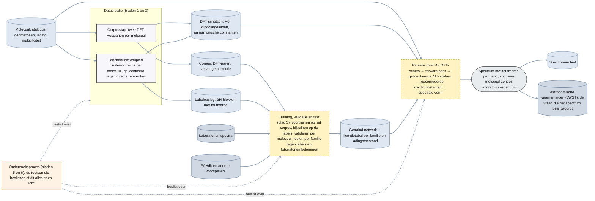
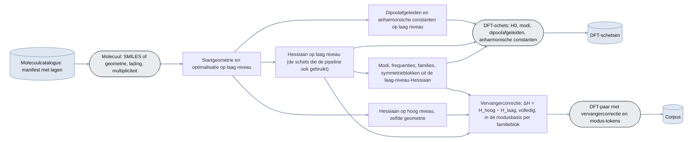
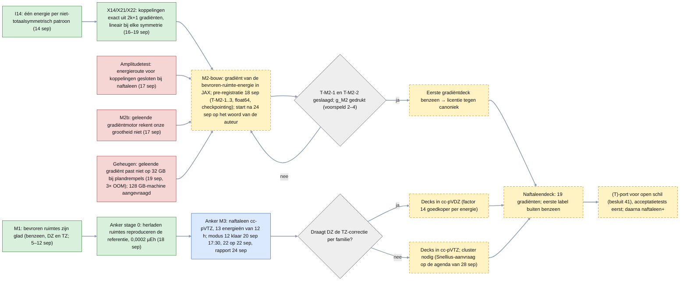

# Architectuur plan 05 (voor de auteurs, Nederlands; eerste versie 19 september 2026, herzien 20 september)

**Vier soorten diagram, uit elkaar gehouden (afspraak van 20 september).**

| soort | wat het toont | bladen |
|---|---|---|
| **Datacreatie** | processen die opslagen vullen: de labelfabriek (coupled-cluster-correcties per molecuul) en de corpusstap (DFT-paren) | 1, 2 |
| **Training, validatie en test** | het proces waar een getraind netwerk met licentietabel uit komt; hier hoort de score tegen de laboratoriumkolommen (de test) | 3 |
| **Pipeline** | wat er staat als onderzoek en training klaar zijn: molecuul in, forward pass als één figuurtje, spectrale vorm uit, naar de astronoom | 4 (en 4a: de componenten van het netwerk) |
| **Onderzoeksproces** | de toetsen die beslissen of dit alles er zo komt; het enige soort blad waar data, besluiten en experimentnummers in mogen | 5, 6 |

Het overzicht (blad 0) toont de vier soorten en de opslagen die ze verbinden. Rekenplaats staat er voorlopig niet in; die komt later per blokje.

**Legenda.**

| figuur | betekenis |
|---|---|
| rechthoek | processtap: een bewerking die data omzet in andere data (op blad 0: een heel proces) |
| rechthoek met ronde uiteinden (grijs) | data-object: een invoer, tussenproduct of uitkomst die door het proces stroomt |
| cilinder | opslag: een verzameling die blijft bestaan en door meerdere processen wordt gelezen of gevuld; getekend onder het data-object dat eruit komt of erin gaat; donkerder blauw = extern, niet van ons |
| ruit (groen) | poort: een toets met een vooraf vastgelegde uitkomst — door, of niet door |
| doorgetrokken rand | bestaat en is gemeten |
| gestippelde rand, gele vulling | nog niet gebouwd |
| pijl | datastroom |

Op de onderzoeksprocesbladen: groen = geslaagd, blauw = loopt, gestippeld = nog te doen, rood = verloren en gesloten. Elk proces begint bij een opslag → data-object en eindigt bij data-object → opslag. Bron van waarheid: de `.mmd`-bestanden in deze map (Mermaid; renderen op GitHub).

## 0. Overzicht: vier soorten proces en hun opslagen

## 1. Datacreatie — de labelfabriek: hoe één label ontstaat

```mermaid
%% Datacreatie — de labelfabriek: hoe één label ontstaat (niveau 3).
%% Rechthoek = processtap; ronde uiteinden = data-object; cilinder = opslag (onder het data-object); ruit = poort. Gestippeld = nog niet gebouwd.
flowchart LR
  linkStyle default stroke:#8a9bb0,stroke-width:2.2px
  classDef planned stroke-dasharray: 6 4,stroke:#b8860b,fill:#fff3c4,color:#111
  classDef data fill:#e9ecef,stroke:#555,color:#111
  classDef gate fill:#d9f0dc,stroke:#2e7d32,color:#111
  classDef store fill:#dfe7f2,stroke:#5b7a99,color:#111

  subgraph IN [" "]
    direction TB
    GEO(["Molecuul: geoptimaliseerde geometrie, lading, multipliciteit"]):::data
    CAT[("Molecuulcatalogus")]:::store
    CAT --> GEO
  end
  H0["Stage A: DFT-Hessiaan H0 → modi L, frequenties, families, irreps"]
  SKETCH(["DFT-schets"]):::data
  SYM["Symmetrieprior: koppeling alleen binnen een irrep-blok"]
  PAT["Patronen: gradiëntrichtingen voor de koppelingen, ±q langs enkele modi voor de diagonaal"]
  DECK(["Deck"]):::data
  REF["Referentieruimtes op x0: lokale orbitalen en fragmentruimtes, één keer gebouwd en verzegeld"]
  TRANS["Transport van de ruimtes naar elke deckgeometrie"]
  EN["Coupled-cluster-energieën in de bevroren ruimtes"]
  GR["Coupled-cluster-gradiënten in de bevroren ruimtes"]:::planned
  OPEN["Open-schil-variant voor kationen"]:::planned
  RESP(["Responsen: energieën en gradiënten per patroon, met ruis"]):::data
  SOLVE["Oplossing per familieblok: diagonaal en koppelingen"]
  BUDGET["Foutbudget per familie: ruis, quartische term, herstelfout"]
  LIC{"Licentie tegen direct berekende referenties"}:::gate
  subgraph OUT [" "]
    direction TB
    LABEL(["Label: ΔH-blokken met foutmarge per familie"]):::data
    STORE[("Labelopslag")]:::store
    LABEL --> STORE
  end
  style IN fill:none,stroke:none
  style OUT fill:none,stroke:none

  GEO --> H0 --> SKETCH --> SYM --> PAT --> DECK
  SKETCH --> REF --> TRANS
  DECK --> TRANS
  TRANS --> EN --> RESP
  TRANS --> GR --> RESP
  TRANS --> OPEN --> RESP
  RESP --> SOLVE --> LIC
  RESP --> BUDGET --> LIC
  LIC --> LABEL
```

## 2. Datacreatie — het corpus van DFT-paren

## 3. Training, validatie en test

```mermaid
%% Training, validatie en test (niveau 3): uit corpus en labels komt een getraind netwerk met een licentietabel. Nog niet begonnen.
%% Rechthoek = processtap; ronde uiteinden = data-object; cilinder = opslag (onder het data-object); ruit = poort. Gestippeld = nog niet gebouwd.
flowchart LR
  linkStyle default stroke:#8a9bb0,stroke-width:2.2px
  classDef planned stroke-dasharray: 6 4,stroke:#b8860b,fill:#fff3c4,color:#111
  classDef data fill:#e9ecef,stroke:#555,color:#111
  classDef gate fill:#d9f0dc,stroke:#2e7d32,color:#111
  classDef store fill:#dfe7f2,stroke:#5b7a99,color:#111
  classDef ext fill:#cfd8e3,stroke:#3d5a80,color:#111

  subgraph IN1 [" "]
    direction TB
    PROXY(["DFT-paren met vervangercorrectie en modus-tokens"]):::data
    CORPUS[("Corpus")]:::store
    CORPUS --> PROXY
  end
  subgraph IN2 [" "]
    direction TB
    LAB(["Labels: ΔH-blokken met foutmarge per familie"]):::data
    LABELS[("Labelopslag")]:::store
    LABELS --> LAB
  end
  SPLIT["Splitsing per molecuul en per kern: train, validatie, test — vastgelegd vóór het trainen"]:::planned
  PRE["Voortrainen op de vervangercorrectie: bloktarget per familie, gebalanceerd verlies"]:::planned
  FT["Bijtrainen op de labels: kleine leersnelheid, vroeg stoppen op de validatiemoleculen"]:::planned
  ENS["Ensemble over seeds"]:::planned
  VAL["Validatie: fout per familie op de validatiemoleculen, tegen de nulregel, de mediaanregel en de type-overdracht"]:::planned
  TEST["Test op de testmoleculen: ΔH-blokken en het spectrum dat eruit volgt"]:::planned
  LABDB[("Laboratoriumspectra")]:::ext
  PAHDB[("PAHdb en andere voorspellers")]:::ext
  SCORE{"Licentie per familie en ladingstoestand: fout onder de marge van de scorekolom van die familie"}:::gate
  CAL["Kalibratie van de onzekerheid: spreiding van het ensemble tegen de gemeten fout"]:::planned
  subgraph OUT [" "]
    direction TB
    MODEL(["Getraind netwerk + licentietabel + kalibratie"]):::data
    MODELS[("Modelopslag")]:::store
    MODEL --> MODELS
  end
  subgraph OUT2 [" "]
    direction TB
    RES(["Testscores per band en familie, naast de opponenten"]):::data
    RESS[("Scorearchief")]:::store
    RES --> RESS
  end
  style IN1 fill:none,stroke:none
  style IN2 fill:none,stroke:none
  style OUT fill:none,stroke:none
  style OUT2 fill:none,stroke:none

  PROXY --> SPLIT
  LAB --> SPLIT
  SPLIT --> PRE --> FT --> ENS --> VAL --> TEST --> SCORE
  LABDB --> SCORE
  PAHDB --> TEST
  SCORE --> RES
  SCORE --> CAL --> MODEL
```

## 4. Pipeline

```mermaid
%% Pipeline (niveau 3): wat er staat als onderzoek en training klaar zijn. Een molecuul zonder laboratoriumspectrum in, een spectrum met foutmarge uit.
%% Rechthoek = processtap; ronde uiteinden = data-object; cilinder = opslag (onder het data-object); ruit = poort. Gestippeld = nog niet gebouwd. De forward pass is één figuurtje.
flowchart LR
  linkStyle default stroke:#8a9bb0,stroke-width:2.2px
  classDef planned stroke-dasharray: 6 4,stroke:#b8860b,fill:#fff3c4,color:#111
  classDef data fill:#e9ecef,stroke:#555,color:#111
  classDef gate fill:#d9f0dc,stroke:#2e7d32,color:#111
  classDef store fill:#dfe7f2,stroke:#5b7a99,color:#111
  classDef ext fill:#cfd8e3,stroke:#3d5a80,color:#111

  subgraph IN [" "]
    direction TB
    MOL(["Molecuul: geometrie, lading, multipliciteit"]):::data
    CAT[("Molecuulcatalogus")]:::store
    CAT --> MOL
  end
  SK["DFT-schets: H0, modi, frequenties, families, dipoolafgeleiden, anharmonische constanten"]
  TOK["Modus-tokens"]
  subgraph MD [" "]
    direction TB
    NETW(["Getraind netwerk + licentietabel + kalibratie"]):::data
    MODELS[("Modelopslag")]:::store
    MODELS --> NETW
  end
  FWD["Forward pass: ΔH-blok per familie met onzekerheid"]:::planned
  GATE{"Licentietabel: familie gelicentieerd voor deze ladingstoestand?"}:::gate
  APPLY["Gecorrigeerde krachtconstanten: H0 + ΔH op de gelicentieerde blokken, elders H0, met melding"]
  EIG["Diagonalisatie → bandposities met marge per familie"]
  INT["Intensiteiten uit de dipoolafgeleiden"]
  ANH["Anharmonische verschuiving per band"]
  SHAPE["Spectrale vorm: profiel per band uit positie, intensiteit, marge, temperatuur van de bron en resolutie van het instrument"]
  subgraph OUT [" "]
    direction TB
    SPEC(["Spectrum: posities, intensiteiten, vorm, foutmarge per band, gemarkeerde weigeringen"]):::data
    SPECS[("Spectrumarchief")]:::store
    SPEC --> SPECS
  end
  style IN fill:none,stroke:none
  style MD fill:none,stroke:none
  style OUT fill:none,stroke:none

  MOL --> SK --> TOK --> FWD
  NETW --> FWD
  FWD --> GATE
  NETW --> GATE
  GATE --> APPLY
  SK --> APPLY
  APPLY --> EIG --> SHAPE
  SK --> INT --> SHAPE
  SK --> ANH --> SHAPE
  SHAPE --> SPEC
```

## 4a. Componenten van het netwerk

```mermaid
%% Doelarchitectuur — Componenten van het netwerk (niveau 4). Grotendeels nog niet gebouwd.
%% Rechthoek = processtap; ronde uiteinden = data-object; cilinder = opslag (onder het data-object). Gestippeld = nog niet gebouwd.
flowchart LR
  linkStyle default stroke:#8a9bb0,stroke-width:2.2px
  classDef planned stroke-dasharray: 6 4,stroke:#b8860b,fill:#fff3c4,color:#111
  classDef data fill:#e9ecef,stroke:#555,color:#111
  classDef store fill:#dfe7f2,stroke:#5b7a99,color:#111

  subgraph IN [" "]
    direction TB
    INP(["Per molecuul: modus-tokens, lading, multipliciteit"]):::data
    CORPUS[("Corpus en labelopslag")]:::store
    CORPUS --> INP
  end
  EMB["Embedding van elk modus-token"]
  ENC["Self-attention over de modi van het molecuul"]
  BLK["Blokkop per familie: diagonaal en koppelingen uit de modusvectoren"]:::planned
  PAIR["Paarkop: welke paren dragen een koppeling"]
  UNC["Ensemble over seeds → spreiding per familie"]:::planned
  subgraph OUT [" "]
    direction TB
    OUTB(["ΔH-blok per familie met onzekerheid"]):::data
    STORE[("Voorspellingsopslag")]:::store
    OUTB --> STORE
  end
  style IN fill:none,stroke:none
  style OUT fill:none,stroke:none

  INP --> EMB --> ENC --> BLK --> UNC --> OUTB
  ENC --> PAIR --> OUTB
```

## 5. Onderzoeksproces — de labelfabriek en de decks

## 6. Onderzoeksproces — het netwerk

